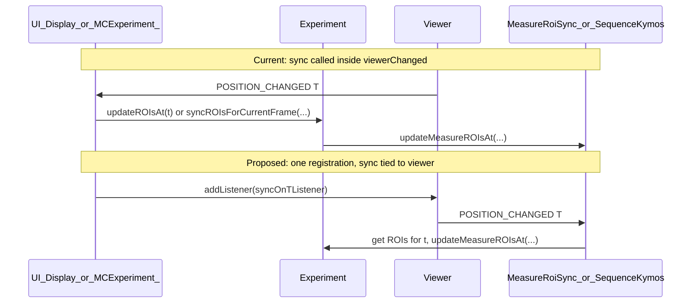

# Tie MeasureRoiSync to sequence by watching T

## Current state

- **MeasureRoiSync** is a stateless utility: `[updateMeasureROIsAt(t, seq, filter, roisForT)](multiTools/src/main/java/plugins/fmp/multitools/experiment/sequence/MeasureRoiSync.java)`. It does not know *when* to run; callers decide.
- **Two call sites** (hardcoded in the UI layer):
  1. **Camera:** `[MCExperiment_.viewerChanged](multiCAFE/src/main/java/plugins/fmp/multicafe/dlg/experiment/MCExperiment_.java)` (line 216) calls `exp.updateROIsAt(t)` when the camera viewer's T changes. `[Experiment.updateROIsAt(t)](multiTools/src/main/java/plugins/fmp/multitools/experiment/Experiment.java)` (line 1209) then calls `MeasureRoiSync.updateMeasureROIsAt(..., seqCamData, FLY_POSITION, cages.getPositions...)`.
  2. **Kymos:** `[Display.viewerChanged](multiCAFE/src/main/java/plugins/fmp/multicafe/dlg/kymos/Display.java)` and `[Display.selectKymographImage](multiCAFE/src/main/java/plugins/fmp/multicafe/dlg/kymos/Display.java)` call `seqKymos.syncROIsForCurrentFrame(t, capillaries)`, which internally uses `MeasureRoiSync.updateMeasureROIsAt(..., seqKymos, CAPILLARY_MEASURES, roisForT)` plus transfer-from-previous-frame and refresh.

So "when T changes, sync ROIs" is duplicated in two different listener implementations; adding a new sequence that needs the same behavior would require another hardcoded call site.

## Two modes, one abstraction

Both current use cases fit the same pattern: **t drives which element is displayed; that element is not stored as a ROI but ROIs are generated from it.**

- **Fly positions:** An array (cages / position data) with as many elements as needed; t is the index. The element at t is not a ROI; ROIs are created from it (e.g. `cages.getPositionsAsListOfROI2DRectanglesAtT(t)`). Data is measures/aggregates (x, y, t, span, direction?) hosted by Cage.
- **Capillary measures:** Capillaries, each associated with a t (kymograph index). At t we take the capillary for that t and generate ROIs from its measures (toplevel, bottomlevel, etc.). Analogous to fly positions: ROI is generated from the element at t.

**Generic design:** Pass to the RoiSync attachment **an object that describes which ROIs to display** for a given t (e.g. an array or provider indexed by t):

- **ROI source:** `IntFunction<List<ROI2D>>` or interface `ROIProviderForT { List<ROI2D> getROIsForFrame(int t); }`. Implementation encapsulates the "array" (cages, capillaries) and the conversion to ROIs.
- **Saved per viewer instance:** sequence, filter (MeasureRoiFilter), and this ROI source (plus any options). On T change, listener runs: remove ROIs matching filter, add source.apply(t).

Fly and capillary become two implementations of that source; no hardcoded mode in the sync logic.

## Proposed approach: register "sync on T" once per viewer

**Idea:** When a viewer is attached to a sequence that needs measure-ROI sync, register a **single** listener that reacts to `POSITION_CHANGED` (dimension T) and runs the appropriate sync. After that, any T change (combo, timeline, or programmatic) triggers sync; no need to call sync from `viewerChanged` or `selectKymographImage`.

**Where to register**

- **Camera:** When the camera viewer is created or reused in `[MCExperiment_.updateViewerForSequenceCam](multiCAFE/src/main/java/plugins/fmp/multicafe/dlg/experiment/MCExperiment_.java)` (around line 171: `v.addListener(parent)`). Today `parent` (MCExperiment_) implements `viewerChanged` and there calls `exp.updateROIsAt(t)`. Option A: add a **second** listener on the same viewer, e.g. one that only handles POSITION_CHANGED T and calls `exp.updateROIsAt(t)`, and remove that call from `viewerChanged` (viewerChanged would still do setTitle, saveDetRoisToPositions). Option B: keep a single listener but move the "sync on T" logic into Experiment by having the existing listener call a new method like `exp.onCameraViewerTChanged(t)` that does updateROIsAt(t); that doesn't "tie to sequence" but centralizes the trigger in Experiment.
- **Kymos:** When the kymos viewer is created or reused in `[Display.displayON](multiCAFE/src/main/java/plugins/fmp/multicafe/dlg/kymos/Display.java)` (lines 243 and 282: `addListener(this)`). Same idea: either a dedicated listener that on T change runs the current kymos sync (transfer + `seqKymos.syncROIsForCurrentFrame(t, capillaries)` + refresh), or a method on Experiment/SequenceKymos that Display's listener calls.

**Recommended: centralize in Experiment**

- **Experiment** owns both `seqCamData` (camera) and `seqKymos` (kymos) and already has `updateROIsAt(t)` and access to capillaries. So:
  1. Add **Experiment.attachMeasureRoiSyncToViewer(Viewer v, boolean isCamera)** (or two methods `attachCameraSync`, `attachKymosSync`).
    - If camera: add a listener (or store a runnable that the UI listener will call) that on POSITION_CHANGED T calls `updateROIsAt(t)`.
    - If kymos: add a listener that on POSITION_CHANGED T gets capillaries from the experiment and calls `getSeqKymos().syncROIsForCurrentFrame(t, getCapillaries())` (and transfer/refresh if not already inside syncROIsForCurrentFrame).
  2. **When to call attach:**
    - Camera: in `[MCExperiment_.updateViewerForSequenceCam](multiCAFE/src/main/java/plugins/fmp/multicafe/dlg/experiment/MCExperiment_.java)` after `v.addListener(parent)`, call `exp.attachMeasureRoiSyncToViewer(v, true)` (and avoid double registration if the same viewer is reused).
    - Kymos: in `[Display.displayON](multiCAFE/src/main/java/plugins/fmp/multicafe/dlg/kymos/Display.java)` after adding `this` as listener (new or existing viewer), call `exp.attachMeasureRoiSyncToViewer(v, false)` (with `v` the kymos viewer and `exp` from parent0.expListComboLazy.getSelectedItem()).
  3. **Remove** the explicit `exp.updateROIsAt(t)` from `[MCExperiment_.viewerChanged](multiCAFE/src/main/java/plugins/fmp/multicafe/dlg/experiment/MCExperiment_.java)` and the explicit `seqKymos.syncROIsForCurrentFrame(...)` (and refresh) from `[Display.viewerChanged](multiCAFE/src/main/java/plugins/fmp/multicafe/dlg/kymos/Display.java)`. Keep in viewerChanged: setTitle, saveDetRoisToPositions, selectKymographComboItem, etc.
  4. **selectKymographImage:** can still call `v.setPositionT(isel)` and then `seqKymos.syncROIsForCurrentFrame(...)` once for the initial frame, or rely on the new listener firing when position is set (if setting T programmatically also fires POSITION_CHANGED). If it does not fire, keep one explicit sync in selectKymographImage when the combo triggers the change.

**Listener lifecycle**

- Store the listener (or a registration token) so you can remove it when the viewer is closed or the experiment is unloaded, to avoid leaks and duplicate reactions. `[MCExperiment_.viewerClosed](multiCAFE/src/main/java/plugins/fmp/multicafe/dlg/experiment/MCExperiment_.java)` and any kymos viewer teardown are the right places to remove.

## Complexity assessment

- **Not too complicated:** The sync logic (MeasureRoiSync + transfer/refresh for kymos) stays as is. Only the **trigger** moves: from "inside two viewerChanged implementations" to "one registration per viewer when the viewer is available."
- **Caveats:**
  1. **Who has the viewer?** Camera viewer is created in MCExperiment_; kymos in Display. So registration still happens in the UI, but the *behavior* (what runs on T change) lives in Experiment (or in a small helper that takes a callback).
  2. **Kymos needs capillaries:** The kymos sync needs `exp.getCapillaries()`. So the listener must have a reference to the current experiment (and possibly handle exp == null or seqKymos == null).
  3. **Programmatic T change:** If code calls `v.setPositionT(t)` and ICY does *not* fire POSITION_CHANGED, then selectKymographImage (or similar) must still call sync once when changing frame by combo; that's a small, localized exception.

## Summary

- **Tie sync to sequence:** Register a single "on T change → run sync" listener when the sequence's viewer is available (camera in MCExperiment_, kymos in Display).
- **Generic ROI source:** Pass (sequence, filter, ROIProviderForT or IntFunction) so given t the sync gets the ROIs for that frame; fly and capillary are two implementations.
- **Centralize behavior:** e.g. `attachMeasureRoiSyncToViewer(v, seq, filter, roiSource)` that adds the listener and on T change calls `MeasureRoiSync.updateMeasureROIsAt(t, seq, filter, roiSource.getROIsForFrame(t))`.
- **Remove** the direct sync calls from the two viewerChanged implementations; keep title/combo/save logic there.
- **Cleanup:** Remove the listener when the viewer is closed or the experiment is unloaded.
- **Result:** "When this sequence's viewer T changes, sync these measure ROIs" is configured once per viewer instead of being hardcoded in multiple call sites. Adding another sequence would mean one more attachment with a new ROI source implementation.
