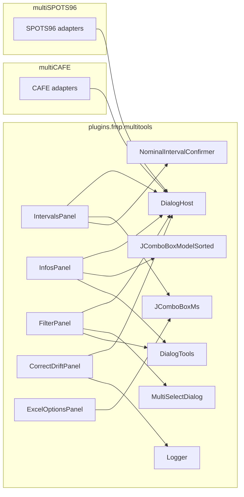

# Shared Dialogs Consolidation Survey

Read-only survey of six near-duplicate dialog pairs between `multiCAFE` and
`multiSPOTS96`. For each pair this document records: structural summary,
three-bucket diff (cosmetic / plugin-specific / silent drift), exhaustive
`parent0.*` access map, and a proposed minimum host-interface.

No source code is modified as part of this survey. Migration planning is
deferred to a follow-up document.

---

## 0. Context

Both plugins share the same shape:

- `multiCAFE.expListComboLazy` and `multiSPOTS96.expListComboLazy` are the
  **same type** (`plugins.fmp.multitools.tools.JComponents.JComboBoxExperimentLazy`).
- `multiCAFE.descriptorIndex` and `multiSPOTS96.descriptorIndex` are the
  **same type** (`plugins.fmp.multitools.tools.DescriptorIndex`).
- Both main classes extend `icy.plugin.abstract_.PluginActionable`, which
  provides `getPreferences(String node) -> XMLPreferences`.
- Divergent sibling-pane access:
  - multiCAFE: `paneBrowse.panelLoadSave`, `paneExperiment.{tabInfos,tabFilter,tabOptions,tabsPane}`, `paneCapillaries.{tabCreate,tabInfos}`.
  - multiSPOTS96: `dlgBrowse.loadSaveExperiment`, `dlgExperiment.{tabInfos,tabFilter,tabOptions,tabsPane}`, `dlgMeasure.tabCharts`.

The "filtered" checkbox lives in both plugins at the same conceptual place,
in a `LoadSaveExperiment` panel:
- multiCAFE: `paneBrowse.panelLoadSave.filteredCheck`
- multiSPOTS96: `dlgBrowse.loadSaveExperiment.filteredCheck`

This is a strong candidate for a tiny "browse-panel" accessor on the host
interface (`getFilteredCheck() -> JCheckBox`) rather than threading plugin
type into the shared panel.

---

## 1. Intervals

- [multiCAFE/src/main/java/plugins/fmp/multicafe/dlg/experiment/Intervals.java](multiCAFE/src/main/java/plugins/fmp/multicafe/dlg/experiment/Intervals.java) (~17 KB, 434 lines)
- [multiSPOTS96/src/main/java/plugins/fmp/multiSPOTS96/dlg/a_experiment/Intervals.java](multiSPOTS96/src/main/java/plugins/fmp/multiSPOTS96/dlg/a_experiment/Intervals.java) (~14 KB, 359 lines)

### 1.1 Structural summary

Both are `JPanel implements ItemListener`, with the same widget set:

- `indexFirstImageJSpinner`, `fixedNumberOfImagesJSpinner`, `clipNumberImagesCombo`
- `binSizeJSpinner`, `binUnit (JComboBoxMs)`, `nominalIntervalJSpinner`
- `applyButton`, `refreshButton`, `advancedToggleButton`
- `analysisIntervalLabel`, `classSummaryLabel`
- `advancedPanel` (+ `advancedPanel1` in multiCAFE only)

Both call the same shared helper
`plugins.fmp.multitools.experiment.NominalIntervalConfirmer` for the two
confirmation flows, and both use `GenerationMode` / `ImageLoader` /
`ExperimentDirectories` / `Experiment` from `multitools`.

### 1.2 Diff buckets

**Cosmetic / refactor-only**
- Layout: multiCAFE splits Advanced into two rows (`advancedPanel` + `advancedPanel1`); multiSPOTS96 keeps them on one row. Pick one.
- `clipNumberImagesCombo` label text identical.
- `nominalIntervalJSpinner` initial `SpinnerNumberModel(60,...)` in multiCAFE vs `SpinnerNumberModel(15,...)` in multiSPOTS96 — this is the **default nominal interval**, which must become injectable.

**Plugin-specific behaviour**
- Post-apply: multiCAFE runs `paneExperiment.updateDialogs(exp)`, `paneExperiment.updateViewerForSequenceCam(exp)`, `paneExperiment.tabOptions.applyCentralViewOptionsToCamViewer(exp)` after closing `paneBrowse.panelLoadSave.closeCurrentExperiment()`. multiSPOTS96 simply does `dlgBrowse.loadSaveExperiment.closeCurrentExperiment()` then `openSelectedExperiment(exp)`. These are clearly plugin-level actions and belong behind a host hook.
- Default-nominal persistence: multiCAFE writes to `viewOptions.setDefaultNominalIntervalSec(...)` + `viewOptions.save(getPreferences("viewOptions"))`. multiSPOTS96 keeps a private `XMLPreferences` node `multiSPOTS96Intervals/defaultNominalIntervalSec`. Both belong behind a host hook.

**Silent drift (likely bug fixes present in only one side)**
- multiCAFE guards against re-entrancy in spinner listeners with `updatingFromExperiment`; multiSPOTS96 has no such guard.
- multiCAFE has an extra `updateNFramesButton` ("Update") next to `fixedNumberOfImagesJSpinner` that rescans the directory and sets the end-exclusive bound cleanly; multiSPOTS96 lacks it.
- multiCAFE's `fixedNumberOfImagesJSpinner` change handler is considerably more careful: it clamps `requestedCount` against images available on disk, stores end-exclusive semantics (`absFirst + clampedCount`), and short-circuits if unchanged. multiSPOTS96 just writes the raw spinner value. The multiCAFE version looks like a real bug fix.
- Summary label treats `GenerationMode.UNKNOWN`: multiCAFE prints `"unknown"`, multiSPOTS96 coerces to `DIRECT_FROM_STACK` because multiSPOTS96 does not support kymographs.

### 1.3 `parent0.*` access map

multiCAFE (34 references) accesses:
- `parent0.expListComboLazy.getSelectedItem()` (read, many sites)
- `parent0.paneExperiment.updateDialogs(exp)` (write)
- `parent0.paneExperiment.updateViewerForSequenceCam(exp)` (write)
- `parent0.paneExperiment.tabOptions.applyCentralViewOptionsToCamViewer(exp)` (write)
- `parent0.paneBrowse.panelLoadSave.closeCurrentExperiment()` (write)
- `parent0.viewOptions.getDefaultNominalIntervalSec()` (read)
- `parent0.viewOptions.setDefaultNominalIntervalSec(nominalSec)` (write)
- `parent0.viewOptions.save(parent0.getPreferences("viewOptions"))` (write)
- `parent0.getPreferences("viewOptions")` (read, inherited from `PluginActionable`)

multiSPOTS96 (11 references) accesses:
- `parent0.expListComboLazy.getSelectedItem()` (read, many sites)
- `parent0.dlgBrowse.loadSaveExperiment.closeCurrentExperiment()` (write)
- `parent0.dlgBrowse.loadSaveExperiment.openSelectedExperiment(exp)` (write)
- `parent0.getPreferences("multiSPOTS96Intervals")` (read, inherited)

### 1.4 Proposed host interface

```java
// multitools.experiment
public interface IntervalsHost {
    JComboBoxExperimentLazy getExperimentsCombo();

    int  getDefaultNominalIntervalSec();
    void setDefaultNominalIntervalSec(int sec);

    // called after "Apply changes" is pressed, with the modified experiment.
    // multiCAFE: refresh paneExperiment + viewer, close panelLoadSave;
    // multiSPOTS96: close + reopen experiment.
    void onAfterIntervalsApply(Experiment exp);

    // called when user changes indexFirstImageJSpinner; multiCAFE refreshes
    // the cam viewer, multiSPOTS96 defaults to no-op.
    default void onFirstImageIndexChanged(Experiment exp) { }
}
```

### 1.5 Open questions

- Should multiSPOTS96 adopt multiCAFE's re-entrancy guard and
  end-exclusive clamp as part of the consolidation (both look like
  genuine bug fixes)?
- Should multiSPOTS96 migrate its `multiSPOTS96Intervals` preferences node
  into `ViewOptionsHolder` so the shared panel can use a single storage
  contract (`viewOptions.getDefaultNominalIntervalSec() /
  setDefaultNominalIntervalSec(...)`), or keep the two storage paths and
  expose both through `IntervalsHost`?

---

## 2. Infos

- [multiCAFE/src/main/java/plugins/fmp/multicafe/dlg/experiment/Infos.java](multiCAFE/src/main/java/plugins/fmp/multicafe/dlg/experiment/Infos.java) (~11 KB, 278 lines)
- [multiSPOTS96/src/main/java/plugins/fmp/multiSPOTS96/dlg/a_experiment/Infos.java](multiSPOTS96/src/main/java/plugins/fmp/multiSPOTS96/dlg/a_experiment/Infos.java) (~10 KB, 248 lines)

### 2.1 Structural summary

Both are `JPanel` with the identical 8-combo descriptor editor
(`EXP_EXPT / EXP_ID / EXP_STIM1 / EXP_CONC1 / EXP_STRAIN / EXP_SEX /
EXP_STIM2 / EXP_CONC2`), matching labels, four buttons (`Load`, `Save`,
`Get previous`, `zoom top`), and identical `transferPreviousExperimentInfosToDialog`,
`getExperimentInfosFromDialog`, `initCombos`, `refreshComboFromIndex`,
`clearCombos`, `zoomToUpperCorner` methods.

### 2.2 Diff buckets

**Cosmetic / refactor-only**
- Combo-box model class name: multiCAFE uses `SortedComboBoxModel`, multiSPOTS96 uses `JComboBoxModelSorted`. Both are in `multitools.tools.JComponents` and are functionally equivalent (the `JComboBoxModelSorted` implementation is strictly better — binary-search insertion vs linear, has `removeElement`). Unify on `JComboBoxModelSorted`.
- Field names: multiCAFE names labels `xxxLabel`, multiSPOTS96 names them `xxxCheck` even though they are `JLabel` (not `JCheckBox`). Cosmetic only.
- Layout helper: multiCAFE uses a private `addLineOfElements(...)`; multiSPOTS96 uses `DialogTools.addFiveComponentOnARow(...)`. The latter already lives in `multitools.tools.DialogTools`.
- `zoomToUpperCorner`: multiCAFE has a toggle (if already zoomed, zoom out); multiSPOTS96 always zooms in. Minor.

**Plugin-specific behaviour**
- multiCAFE has extra method `transferPreviousExperimentCapillariesInfos(Experiment exp0, Experiment exp)` that touches `parent0.paneCapillaries.tabCreate.setGroupedBy2(...)` and `parent0.paneCapillaries.tabInfos.setDlgInfosCapillaryDescriptors(...)` and copies capillary grouping/volume across experiments. It is called from `duplicatePreviousDescriptors()` only in multiCAFE. This is a real capillary-domain concern that multiSPOTS96 has no equivalent for.

**Silent drift**
- `clearCombos()` on multiCAFE clears all 8 combos; on multiSPOTS96 it only clears 6 (misses `stim2Combo`, `conc2Combo`). Small bug fix to carry over.

### 2.3 `parent0.*` access map

multiCAFE (12 references):
- `parent0.expListComboLazy.{getSelectedItem, getSelectedIndex, getItemAt, getFieldValuesToComboLightweight}` (read)
- `parent0.descriptorIndex.{isReady, getDistinctValues}` (read)
- `parent0.paneCapillaries.tabCreate.setGroupedBy2(boolean)` (write)
- `parent0.paneCapillaries.tabInfos.setDlgInfosCapillaryDescriptors(capillaries)` (write)

multiSPOTS96 (9 references):
- `parent0.expListComboLazy.{getSelectedItem, getSelectedIndex, getItemAt, getFieldValuesToComboLightweight}` (read)
- `parent0.descriptorIndex.{isReady, getDistinctValues}` (read)

### 2.4 Proposed host interface

```java
// multitools.experiment
public interface InfosHost {
    JComboBoxExperimentLazy getExperimentsCombo();
    DescriptorIndex getDescriptorIndex();

    // called after "Get previous" duplicates descriptors between two
    // experiments. multiCAFE: also copy capillary grouping/volume and
    // notify paneCapillaries. multiSPOTS96: no-op.
    default void onAfterDuplicateDescriptors(Experiment source, Experiment destination) { }
}
```

### 2.5 Open questions

- Is the 2-line drift in `clearCombos()` on multiSPOTS96 (missing
  `stim2/conc2` clears) intentional? If not, consolidation fixes it for free.

---

## 3. Filter

- [multiCAFE/src/main/java/plugins/fmp/multicafe/dlg/experiment/Filter.java](multiCAFE/src/main/java/plugins/fmp/multicafe/dlg/experiment/Filter.java) (~9 KB, 245 lines)
- [multiSPOTS96/src/main/java/plugins/fmp/multiSPOTS96/dlg/a_experiment/Filter.java](multiSPOTS96/src/main/java/plugins/fmp/multiSPOTS96/dlg/a_experiment/Filter.java) (~13 KB, 344 lines)

### 3.1 Structural summary

Both are `JPanel` with the same 8-field filter UI (same 8 `JCheckBox`, 8
`JButton` "Select…", `applyButton`, `clearButton`, both use
`JComboBoxExperimentLazy filterExpList` as a parallel store, both use
`MultiSelectDialog` for the per-field chooser). Identical
`filterExperimentList`, `clearAllCheckBoxes`, `filterAllItems`,
`filterItemMulti` methods (modulo trivial formatting).

### 3.2 Diff buckets

**Cosmetic / refactor-only**
- Layout comments differ (`// line 0`, `// line 1`, etc. in multiSPOTS96 only).
- `java.util.HashSet` import at top vs `java.util.HashSet` inline in
  multiSPOTS96's `filterItemMulti`.

**Plugin-specific behaviour**
- multiCAFE's apply switches to `parent0.paneExperiment.tabsPane.setSelectedIndex(0)`; multiSPOTS96's to `parent0.dlgExperiment.tabsPane.setSelectedIndex(0)`. Same intent, different reach path.
- The "filtered" checkbox lives at different paths:
  `parent0.paneBrowse.panelLoadSave.filteredCheck` vs
  `parent0.dlgBrowse.loadSaveExperiment.filteredCheck`.

**Silent drift**
- multiSPOTS96 has an extra `indexStatusLabel` showing "index: ready" / "index: loading..." on a 5th layout row. Minor UX addition.
- multiSPOTS96's `getValuesForField(...)` first tries `descriptorIndex.getDistinctValues(field)` when the index is ready, only falling back to the lightweight scan. multiCAFE always uses the lightweight scan. This is a real performance improvement worth adopting in both.
- multiCAFE uses a factory `createFilterButtonListener(...)` that centralises the 8 filter button listeners, including `checkBox.setSelected(!selectionList.isEmpty())` to auto-tick the field's checkbox after a selection. multiSPOTS96 has 8 inline listeners and does NOT auto-tick the checkbox — meaning the user has to click "Select…" AND tick the checkbox to activate the filter. The multiCAFE UX is clearly better; missing auto-tick in multiSPOTS96 is drift.

### 3.3 `parent0.*` access map

multiCAFE (6 references):
- `parent0.expListComboLazy.{setExperimentsFromList, getItemCount, setSelectedIndex, getExperimentsAsList}` (read/write)
- `parent0.paneBrowse.panelLoadSave.filteredCheck.{isSelected, setSelected}` (read/write)
- `parent0.paneExperiment.tabsPane.setSelectedIndex(0)` (write)

multiSPOTS96 (7 references):
- `parent0.expListComboLazy.{setExperimentsFromList, getItemCount, setSelectedIndex, getExperimentsAsListNoLoad}` (read/write)
- `parent0.descriptorIndex.{isReady, getDistinctValues}` (read)
- `parent0.dlgBrowse.loadSaveExperiment.filteredCheck.{isSelected, setSelected}` (read/write)
- `parent0.dlgExperiment.tabsPane.setSelectedIndex(0)` (write)

### 3.4 Proposed host interface

```java
// multitools.experiment
public interface FilterHost {
    JComboBoxExperimentLazy getExperimentsCombo();
    DescriptorIndex getDescriptorIndex();   // may return null / not-ready

    // Small accessor to avoid threading plugin-specific browse-pane types.
    JCheckBox getFilteredCheck();

    // Called after Apply to bring the Experiment tab to the front.
    void selectExperimentTab();
}
```

Alternative: expose `getFilteredCheck()` as a method on a shared
`LoadSaveExperimentApi` that both plugins' `LoadSaveExperiment` panels
already implement in practice. That would cut one host method.

### 3.5 Open questions

- Should the `indexStatusLabel` be added to the consolidated panel for both plugins (recommended), or hidden behind a flag?
- Auto-ticking checkbox on field select: adopt multiCAFE's behaviour for both plugins (recommended)?
- Drop `getExperimentsAsList` (multiCAFE) in favour of `getExperimentsAsListNoLoad` (multiSPOTS96) to avoid triggering lazy loads during filtering? Needs confirmation from Fred.

---

## 4. Edit — NOT A DROP-IN PAIR

- [multiCAFE/src/main/java/plugins/fmp/multicafe/dlg/experiment/EditCapillariesConditional.java](multiCAFE/src/main/java/plugins/fmp/multicafe/dlg/experiment/EditCapillariesConditional.java) (~16 KB, 436 lines)
- [multiSPOTS96/src/main/java/plugins/fmp/multiSPOTS96/dlg/a_experiment/Edit.java](multiSPOTS96/src/main/java/plugins/fmp/multiSPOTS96/dlg/a_experiment/Edit.java) (~8 KB, 238 lines)

### 4.1 Summary

These two dialogs share INTENT (bulk editing of descriptor fields across
experiments) but have **fundamentally different UIs and algorithms**.

multiCAFE's `EditCapillariesConditional`:
- Two conditions joined by AND (second optional) + target field + new value.
- Supports mixed experiment-level and capillary-level fields with careful
  per-capillary iteration logic (see `replaceFieldWithConditions(...)`).
- Synchronous over the experiment list; waits on `exp.isSaving()` with a
  30-second timeout before each update to avoid conflicts with async saves
  (`waitForSaveToComplete`).
- Dispatches to `Experiment.setExperimentFieldNoTest(...)` or
  `Capillary.setField(...)` depending on field type.

multiSPOTS96's `Edit`:
- Single match "field + old value" → replace with "new value".
- Supports experiment, cage, and spot-level fields via a
  `switch(fieldEnumCode)` dispatch to
  `replaceExperimentFieldIfEqualOldValue / replaceCageFieldValueWithNewValueIfOld
  / replaceSpotsFieldValueWithNewValueIfOld`.
- Asynchronous via `SwingWorker` with a `ProgressFrame`.
- After completion, updates `descriptorIndex` incrementally, refreshes
  sibling tabs (`dlgExperiment.tabInfos.initCombos()`,
  `dlgExperiment.tabFilter.initCombos()`), reloads chart panels
  (`dlgMeasure.tabCharts.displayChartPanels(exp)`).

### 4.2 `parent0.*` access map

multiCAFE: only `parent0.expListComboLazy.{getItemCount, getItemAt}` — the
actual work is done on `Experiment` / `Capillary` instances directly.

multiSPOTS96: `parent0.descriptorIndex.{isReady, preloadFromCombo,
removeValue, addValue, getDistinctValues}`, `parent0.expListComboLazy.{getSelectedItem,
getExperimentsAsListNoLoad}`, `parent0.dlgExperiment.tabInfos.initCombos()`,
`parent0.dlgExperiment.tabFilter.initCombos()`,
`parent0.dlgMeasure.tabCharts.displayChartPanels(exp)`.

### 4.3 Recommendation

**Do not attempt to unify these into a single shared panel in this pass.**
The right move is one of the following, and I recommend clarifying with
the user before designing:

- **Option A (minimal):** keep both UIs plugin-specific. Only extract the
  non-UI helpers into multiTools:
  - `waitForSaveToComplete(Experiment, long timeoutMs)` into
    `multitools.experiment.ExperimentSaveSync` or similar.
  - The async progress-driven "iterate + apply + index-update + sibling-refresh"
    engine into a `BulkDescriptorEditor` abstraction under
    `multitools.experiment`, parameterised with a `BulkEditHost` (for sibling
    refresh hooks).
- **Option B (design work):** design a unified Edit dialog with the
  superset of both UIs (1 or 2 conditions, sync or async, targeting
  experiment/cage/spot/capillary fields). This is a new feature, not a
  consolidation, and should be scoped separately.

### 4.4 Open questions

- Confirm the user's preference between Option A and Option B.
- Does multiCAFE want the progress-bar + incremental index update flow
  multiSPOTS96 uses? (if yes, Option A makes the non-UI engine shared.)

---

## 5. CorrectDrift — near-perfect duplicate

- [multiCAFE/src/main/java/plugins/fmp/multicafe/dlg/experiment/CorrectDrift.java](multiCAFE/src/main/java/plugins/fmp/multicafe/dlg/experiment/CorrectDrift.java) (~18 KB, 541 lines)
- [multiSPOTS96/src/main/java/plugins/fmp/multiSPOTS96/dlg/a_experiment/CorrectDrift.java](multiSPOTS96/src/main/java/plugins/fmp/multiSPOTS96/dlg/a_experiment/CorrectDrift.java) (~18 KB, 542 lines)

### 5.1 Summary

The two files are character-for-character near-identical. They already
delegate all real work to `plugins.fmp.multitools.series.{RegistrationOptions,
RegistrationProcessor, SafeRegistrationProcessor}` and
`plugins.fmp.multitools.tools.registration.GaspardRigidRegistration`.

### 5.2 Diff buckets

**Cosmetic / refactor-only**
- Package + import line.
- `init(GridLayout, MultiCAFE)` vs `init(GridLayout, MultiSPOTS96)`. The
  body only reads `parent0.expListComboLazy`; the rest of `parent0` is
  commented out in both files (`// this.parent0 = parent0;`).

**Plugin-specific behaviour**
- None.

**Silent drift**
- Logger choice:
  - multiCAFE uses `plugins.fmp.multitools.tools.Logger.info/warn/error`.
  - multiSPOTS96 uses `java.util.logging.Logger.info/warning/severe`.
  Both live in the same file, doing the same logging.

### 5.3 `parent0.*` access map

Both files only touch `parent0.expListComboLazy` and copy it to a private
`experimentList` field. Nothing else.

### 5.4 Proposed host interface

```java
// multitools.experiment
public interface CorrectDriftHost {
    JComboBoxExperimentLazy getExperimentsCombo();
}
```

This is small enough that it could reuse a shared `DialogHost` base
interface instead of introducing a dedicated one (see synthesis §7).

### 5.5 Open questions

- Which logger should the consolidated class use? Recommendation: pick
  `plugins.fmp.multitools.tools.Logger` (already in multiTools and used
  by Intervals and multiCAFE's CorrectDrift), migrate multiSPOTS96's other
  `java.util.logging.Logger` call sites as a follow-up.

---

## Register.java (multiCAFE-only) — classification

- [multiCAFE/src/main/java/plugins/fmp/multicafe/dlg/experiment/Register.java](multiCAFE/src/main/java/plugins/fmp/multicafe/dlg/experiment/Register.java) (~5 KB, 159 lines)

This is **not** a pair with `CorrectDrift.java`. It implements a different
feature: reference-ROI-based polygon registration with pluggable algorithms
(`ImageRegistrationGaspard`, `ImageRegistrationFeatures`,
`ImageRegistrationFeaturesGPU`). Those algorithm classes are already in
`multitools.tools.registration`.

Register uses `parent0.expListComboLazy.getSelectedItem()` and calls into
`exp.getSeqCamData().{setReferenceROI2DPolygon, getReferenceROI2DPolygon,
getSequence}` — no sibling-pane reach. It can stay plugin-specific, since
multiSPOTS96 has no equivalent Polygon-based reference flow today.

---

## 6. Excel Options

- [multiCAFE/src/main/java/plugins/fmp/multicafe/dlg/excel/Options.java](multiCAFE/src/main/java/plugins/fmp/multicafe/dlg/excel/Options.java) (~4 KB, 142 lines)
- [multiSPOTS96/src/main/java/plugins/fmp/multiSPOTS96/dlg/f_excel/Options.java](multiSPOTS96/src/main/java/plugins/fmp/multiSPOTS96/dlg/f_excel/Options.java) (~3 KB, 126 lines)

### 6.1 Structural summary

Both are plain `JPanel` with no `parent0` reference at all. Both expose
the same 7 accessor methods:
`getExcelBuildStep, getStartAllMs, getEndAllMs, getIsFixedFrame,
getStartMs, getEndMs, getBinMs`. Both use `JComboBoxMs` from
`multitools.tools.JComponents`.

### 6.2 Diff buckets

**Cosmetic / refactor-only**
- Nothing of substance.

**Plugin-specific behaviour**
- multiCAFE has 3 extra checkboxes on `panel0`:
  - `collateSeriesCheckBox` ("collate series", off)
  - `padIntervalsCheckBox` ("pad intervals", off; enabled only while
    collate is on via an `ActionListener`)
  - `onlyAliveCheckBox` ("dead=empty", off)
  It also has a commented-out `absoluteTimeCheckBox`.
- multiSPOTS96 has only `exportAllFilesCheckBox` and `transposeCheckBox`.

**Silent drift**
- None.

### 6.3 `parent0.*` access map

Neither file has any. Zero host coupling. **This is the easiest
consolidation candidate of the six.**

### 6.4 Proposed host interface

None needed. The shared panel can be a plain class with a small Builder or
feature-flag constructor:

```java
public final class ExcelOptionsPanel extends JPanel {
    public static final class Features {
        public boolean collateSeries = false;
        public boolean padIntervals  = false;
        public boolean onlyAlive     = false;
    }
    public ExcelOptionsPanel(Features features) { ... }
    // shared accessors stay identical
}
```

multiCAFE instantiates it with all three extras on; multiSPOTS96 with all
three off (fields not added to the panel). Collate-series callers in
multiCAFE already reference `collateSeriesCheckBox` publicly; the field
can stay `public` on the consolidated class.

---

## 7. Synthesis

### 7.1 Cross-pair host-method overlap

The union of host methods across pairs 1 / 2 / 3 / 5 (excluding Edit which
is out of scope and Excel Options which has no host) is quite small:

| Method                                           | Intervals | Infos | Filter | CorrectDrift |
|--------------------------------------------------|:---------:|:-----:|:------:|:------------:|
| `JComboBoxExperimentLazy getExperimentsCombo()`  |     Y     |   Y   |   Y    |       Y      |
| `DescriptorIndex getDescriptorIndex()`           |     -     |   Y   |   Y    |       -      |
| `XMLPreferences getPluginPreferences(String)`    |     Y     |   -   |   -    |       -      |
| `int getDefaultNominalIntervalSec()` (+ setter)  |     Y     |   -   |   -    |       -      |
| `JCheckBox getFilteredCheck()`                   |     -     |   -   |   Y    |       -      |
| `void selectExperimentTab()`                     |     -     |   -   |   Y    |       -      |
| `void onAfterIntervalsApply(Experiment)`         |     Y     |   -   |   -    |       -      |
| `void onFirstImageIndexChanged(Experiment)`      |     Y     |   -   |   -    |       -      |
| `void onAfterDuplicateDescriptors(Experiment, Experiment)` |   -   |   Y   |   -    |       -      |

Options:
- **Option 1 — one small base + per-dialog extensions:** a base `DialogHost`
  interface with the three top rows (`getExperimentsCombo`,
  `getDescriptorIndex`, `getPluginPreferences`) and one `XxxHost` per
  dialog extending it with that dialog's specific hooks. Clearest, small
  cost in interface count.
- **Option 2 — one fat interface:** a single `DialogHost` with all rows,
  hooks as `default`-no-ops. Fewer types; less documentation of intent per
  dialog.

Recommendation: **Option 1**.

### 7.2 Dialog graph



### 7.3 Prerequisite cleanups in `multiTools`

Before (or during) the migration:

1. **Unify sorted combo-box model.** Pick `JComboBoxModelSorted` (better
   impl, more features) and deprecate/remove `SortedComboBoxModel`.
   Affected files:
   - [multiCAFE/src/main/java/plugins/fmp/multicafe/dlg/experiment/Infos.java](multiCAFE/src/main/java/plugins/fmp/multicafe/dlg/experiment/Infos.java)
   - any other multiCAFE files that import `SortedComboBoxModel` (need to sweep).
2. **Pick one logger.** Recommend `plugins.fmp.multitools.tools.Logger`
   everywhere; rewrite multiSPOTS96's
   `java.util.logging.Logger` uses to call it. Scope is small; start with
   CorrectDrift.
3. **Expose `getFilteredCheck()`** on both plugins' `LoadSaveExperiment`
   panels — they already own the checkbox; give it a public getter so
   the shared `FilterPanel` can fetch it via `FilterHost.getFilteredCheck()`
   without a per-plugin cast.
4. **Replace `addLineOfElements` in multiCAFE's `Infos.java`** with
   `DialogTools.addFiveComponentOnARow`. Trivial.
5. **`ViewOptionsHolder` decision.** Either (a) centralise
   `defaultNominalIntervalSec` storage in both plugins' ViewOptionsHolder
   (multiSPOTS96 currently doesn't store it there), or (b) route storage
   through `IntervalsHost.getPluginPreferences(String)`. Recommendation:
   (a), so both sides use the same storage contract.

### 7.4 Recommended migration order

Simplest to most involved, in the order they unlock each other:

1. **Prerequisite cleanups** §7.3: combo model, logger, `getFilteredCheck`,
   `DialogTools`, `ViewOptionsHolder.defaultNominalIntervalSec` on both
   sides.
2. **Excel Options** — no host, just a feature-flagged shared panel.
3. **CorrectDrift** — trivial unification once logger choice is made.
4. **Intervals** — pilot for the `IntervalsHost` pattern; reconcile drift
   in favour of multiCAFE's guard, clamping, and `updateNFramesButton`.
5. **Infos** — after combo-model unification; small host interface.
6. **Filter** — after `getFilteredCheck` accessor exists; reconcile drift
   in favour of multiCAFE's listener factory + auto-tick, and
   multiSPOTS96's `descriptorIndex` fast path and `indexStatusLabel`.
7. **Edit** — separate plan, not a drop-in pair. Most likely Option A
   (extract non-UI helpers) rather than full UI unification.

`Register.java` stays plugin-specific. It is not a consolidation candidate.

### 7.5 What this survey does NOT cover

- Other dialog pairs that might be "nearly identical" but not in the six
  flagged by the user (e.g. `LoadSaveExperiment` pair, `SelectFilesPanel`
  pair — visible in the git status listing). They can be added in a
  follow-up survey.
- Concrete adapter code, new class skeletons, or any source edits.
- The question of whether to fold some of these panels into a single
  shared `DlgExperiment_` tabbed container in multiTools. That is a
  larger architectural question.

---

## 8. Next step

Once the user confirms the direction, the follow-up plan will be:

- Apply cleanups §7.3.
- Pilot with `IntervalsPanel` + `IntervalsHost` + multiCAFE/multiSPOTS96
  adapters, delete the two duplicate `Intervals.java`.
- If pilot goes well, do `Infos`, `Filter`, `CorrectDrift`, `ExcelOptions`
  in that order.
- Put `Edit` on the follow-up agenda with a specific design question
  attached.
