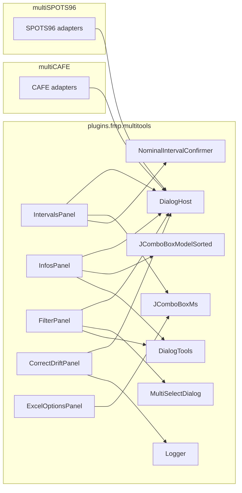

# Shared Dialogs Consolidation Survey

Read-only survey of near-duplicate classes between `multiCAFE` and
`multiSPOTS96`. For each pair this document records: structural
summary, three-bucket diff (cosmetic / plugin-specific / silent drift),
exhaustive `parent0.*` access map, and a proposed minimum host
interface.

Scope has been extended twice since the initial six-pair survey:

- Round 1 (§1–§6): Intervals, Infos, Filter, Edit, CorrectDrift,
  Excel Options.
- Round 2 (§9–§12): Canvas2D package, SelectFilesPanel,
  LoadSaveExperiment, ViewOptionsHolder.

No source code is modified as part of this survey. Migration planning
is deferred to a follow-up document.

---

## 0. Context

Both plugins share the same shape:

- `multiCAFE.expListComboLazy` and `multiSPOTS96.expListComboLazy` are the
  **same type** (`plugins.fmp.multitools.tools.JComponents.JComboBoxExperimentLazy`).
- `multiCAFE.descriptorIndex` and `multiSPOTS96.descriptorIndex` are the
  **same type** (`plugins.fmp.multitools.tools.DescriptorIndex`).
- `multiCAFE.viewOptions` and `multiSPOTS96.viewOptions` are
  **same-named but disjoint** (see §12); both persist under the same
  XMLPreferences node `"viewOptions"`.
- Both main classes extend `icy.plugin.abstract_.PluginActionable`, which
  provides `getPreferences(String node) -> XMLPreferences`.
- Divergent sibling-pane access:
  - multiCAFE: `paneBrowse.panelLoadSave`, `paneExperiment.{tabInfos,tabFilter,tabOptions,tabsPane}`, `paneCapillaries.{tabCreate,tabInfos}`, `paneKymos.*`, `paneCages.*`, `paneLevels.*`.
  - multiSPOTS96: `dlgBrowse.loadSaveExperiment`, `dlgExperiment.{tabInfos,tabFilter,tabOptions,tabsPane}`, `dlgSpots.*`, `dlgMeasure.tabCharts`.

The "filtered" checkbox lives in both plugins at the same conceptual place,
in a `LoadSaveExperiment` panel:
- multiCAFE: `paneBrowse.panelLoadSave.filteredCheck`
- multiSPOTS96: `dlgBrowse.loadSaveExperiment.filteredCheck`

This is a strong candidate for a tiny "browse-panel" accessor on the host
interface (`getFilteredCheck() -> JCheckBox`) rather than threading plugin
type into the shared panel.

Informal naming convention: the `parent0.*` coupling that makes most
of these dialogs non-portable is dominated by a single concern —
**access to `JComboBoxExperimentLazy expListComboLazy`**. The author
has confirmed this was the convenience shortcut that led to the
divergence. A shared `getExperimentsCombo()` accessor on every host
interface (see §7.1) is therefore the highest-leverage single method
in the consolidation.

---

## 1. Intervals

- [multiCAFE/src/main/java/plugins/fmp/multicafe/dlg/experiment/Intervals.java](multiCAFE/src/main/java/plugins/fmp/multicafe/dlg/experiment/Intervals.java) (~17 KB, 434 lines)
- [multiSPOTS96/src/main/java/plugins/fmp/multiSPOTS96/dlg/a_experiment/Intervals.java](multiSPOTS96/src/main/java/plugins/fmp/multiSPOTS96/dlg/a_experiment/Intervals.java) (~14 KB, 359 lines)

### 1.1 Structural summary

Both are `JPanel implements ItemListener`, with the same widget set:

- `indexFirstImageJSpinner`, `fixedNumberOfImagesJSpinner`, `clipNumberImagesCombo`
- `binSizeJSpinner`, `binUnit (JComboBoxMs)`, `nominalIntervalJSpinner`
- `applyButton`, `refreshButton`, `advancedToggleButton`
- `analysisIntervalLabel`, `classSummaryLabel`
- `advancedPanel` (+ `advancedPanel1` in multiCAFE only)

Both call the same shared helper
`plugins.fmp.multitools.experiment.NominalIntervalConfirmer` for the two
confirmation flows, and both use `GenerationMode` / `ImageLoader` /
`ExperimentDirectories` / `Experiment` from `multitools`.

### 1.2 Diff buckets

**Cosmetic / refactor-only**
- Layout: multiCAFE splits Advanced into two rows (`advancedPanel` + `advancedPanel1`); multiSPOTS96 keeps them on one row. Pick one.
- `clipNumberImagesCombo` label text identical.
- `nominalIntervalJSpinner` initial `SpinnerNumberModel(60,...)` in multiCAFE vs `SpinnerNumberModel(15,...)` in multiSPOTS96 — this is the **default nominal interval**, which must become injectable.

**Plugin-specific behaviour**
- Post-apply: multiCAFE runs `paneExperiment.updateDialogs(exp)`, `paneExperiment.updateViewerForSequenceCam(exp)`, `paneExperiment.tabOptions.applyCentralViewOptionsToCamViewer(exp)` after closing `paneBrowse.panelLoadSave.closeCurrentExperiment()`. multiSPOTS96 simply does `dlgBrowse.loadSaveExperiment.closeCurrentExperiment()` then `openSelectedExperiment(exp)`. These are clearly plugin-level actions and belong behind a host hook.
- Default-nominal persistence: multiCAFE writes to `viewOptions.setDefaultNominalIntervalSec(...)` + `viewOptions.save(getPreferences("viewOptions"))`. multiSPOTS96 keeps a private `XMLPreferences` node `multiSPOTS96Intervals/defaultNominalIntervalSec`. Both belong behind a host hook.

**Silent drift (likely bug fixes present in only one side)**
- multiCAFE guards against re-entrancy in spinner listeners with `updatingFromExperiment`; multiSPOTS96 has no such guard.
- multiCAFE has an extra `updateNFramesButton` ("Update") next to `fixedNumberOfImagesJSpinner` that rescans the directory and sets the end-exclusive bound cleanly; multiSPOTS96 lacks it.
- multiCAFE's `fixedNumberOfImagesJSpinner` change handler is considerably more careful: it clamps `requestedCount` against images available on disk, stores end-exclusive semantics (`absFirst + clampedCount`), and short-circuits if unchanged. multiSPOTS96 just writes the raw spinner value. The multiCAFE version looks like a real bug fix.
- Summary label treats `GenerationMode.UNKNOWN`: multiCAFE prints `"unknown"`, multiSPOTS96 coerces to `DIRECT_FROM_STACK` because multiSPOTS96 does not support kymographs.

### 1.3 `parent0.*` access map

multiCAFE (34 references) accesses:
- `parent0.expListComboLazy.getSelectedItem()` (read, many sites)
- `parent0.paneExperiment.updateDialogs(exp)` (write)
- `parent0.paneExperiment.updateViewerForSequenceCam(exp)` (write)
- `parent0.paneExperiment.tabOptions.applyCentralViewOptionsToCamViewer(exp)` (write)
- `parent0.paneBrowse.panelLoadSave.closeCurrentExperiment()` (write)
- `parent0.viewOptions.getDefaultNominalIntervalSec()` (read)
- `parent0.viewOptions.setDefaultNominalIntervalSec(nominalSec)` (write)
- `parent0.viewOptions.save(parent0.getPreferences("viewOptions"))` (write)
- `parent0.getPreferences("viewOptions")` (read, inherited from `PluginActionable`)

multiSPOTS96 (11 references) accesses:
- `parent0.expListComboLazy.getSelectedItem()` (read, many sites)
- `parent0.dlgBrowse.loadSaveExperiment.closeCurrentExperiment()` (write)
- `parent0.dlgBrowse.loadSaveExperiment.openSelectedExperiment(exp)` (write)
- `parent0.getPreferences("multiSPOTS96Intervals")` (read, inherited)

### 1.4 Proposed host interface

```java
// multitools.experiment
public interface IntervalsHost {
    JComboBoxExperimentLazy getExperimentsCombo();

    int  getDefaultNominalIntervalSec();
    void setDefaultNominalIntervalSec(int sec);

    // called after "Apply changes" is pressed, with the modified experiment.
    // multiCAFE: refresh paneExperiment + viewer, close panelLoadSave;
    // multiSPOTS96: close + reopen experiment.
    void onAfterIntervalsApply(Experiment exp);

    // called when user changes indexFirstImageJSpinner; multiCAFE refreshes
    // the cam viewer, multiSPOTS96 defaults to no-op.
    default void onFirstImageIndexChanged(Experiment exp) { }
}
```

### 1.5 Open questions

- **Resolved (2026-04-18, updated):** **keep both** the re-entrancy
  guard and the end-exclusive clamp in the consolidated
  `IntervalsPanel`. The re-entrancy guard is a Swing correctness
  pattern; the clamp guards against the user entering a count larger
  than available frames (see §1.6 for detail). Both are inherited by
  multiSPOTS96 through the consolidation — no separate action needed.
- **Resolved (2026-04-18):** multiSPOTS96 migrates its
  `multiSPOTS96Intervals/defaultNominalIntervalSec` preference into
  the shared `viewOptions` node via `ViewOptionsHolderBase`
  (multiCAFE approach is the more recent). One-time migration step
  required on first run of the consolidated plugin: read the old
  node, write to the new one, delete the old node. Shared
  `IntervalsPanel` uses a single storage contract
  (`host.getDefaultNominalIntervalSec() /
  setDefaultNominalIntervalSec(...)`).

### 1.6 Re-entrancy guard and end-exclusive clamp — decision

**Decision (2026-04-18):** both kept in the consolidated
`IntervalsPanel`.

1. **Re-entrancy guard** (`updatingFromExperiment` boolean). Standard
   Swing idiom. When `IntervalsPanel.updateFromExperiment(exp)`
   programmatically calls `jspinner.setValue(...)`, that triggers
   each spinner's `ChangeListener`, which writes back into the
   experiment, which can re-trigger the update. The guard breaks the
   loop (3 lines total: declare boolean, wrap setValue block,
   short-circuit listeners).

2. **End-exclusive clamp** on `fixedNumberOfImagesJSpinner`. The
   panel interprets the spinner value as "number of images starting
   from `indexFirstImage`" and writes `absFirst + clampedCount` as
   the end-exclusive bound, clamping `clampedCount` against actual
   images on disk. Prevents silent over-count when a user types a
   value larger than available frames.

Both applied for both plugins via the shared panel.

---

## 2. Infos

- [multiCAFE/src/main/java/plugins/fmp/multicafe/dlg/experiment/Infos.java](multiCAFE/src/main/java/plugins/fmp/multicafe/dlg/experiment/Infos.java) (~11 KB, 278 lines)
- [multiSPOTS96/src/main/java/plugins/fmp/multiSPOTS96/dlg/a_experiment/Infos.java](multiSPOTS96/src/main/java/plugins/fmp/multiSPOTS96/dlg/a_experiment/Infos.java) (~10 KB, 248 lines)

### 2.1 Structural summary

Both are `JPanel` with the identical 8-combo descriptor editor
(`EXP_EXPT / EXP_ID / EXP_STIM1 / EXP_CONC1 / EXP_STRAIN / EXP_SEX /
EXP_STIM2 / EXP_CONC2`), matching labels, four buttons (`Load`, `Save`,
`Get previous`, `zoom top`), and identical `transferPreviousExperimentInfosToDialog`,
`getExperimentInfosFromDialog`, `initCombos`, `refreshComboFromIndex`,
`clearCombos`, `zoomToUpperCorner` methods.

### 2.2 Diff buckets

**Cosmetic / refactor-only**
- Combo-box model class name: multiCAFE uses `SortedComboBoxModel`, multiSPOTS96 uses `JComboBoxModelSorted`. Both are in `multitools.tools.JComponents` and are functionally equivalent (the `JComboBoxModelSorted` implementation is strictly better — binary-search insertion vs linear, has `removeElement`). Unify on `JComboBoxModelSorted`.
- Field names: multiCAFE names labels `xxxLabel`, multiSPOTS96 names them `xxxCheck` even though they are `JLabel` (not `JCheckBox`). Cosmetic only.
- Layout helper: multiCAFE uses a private `addLineOfElements(...)`; multiSPOTS96 uses `DialogTools.addFiveComponentOnARow(...)`. The latter already lives in `multitools.tools.DialogTools`.
- `zoomToUpperCorner`: multiCAFE has a toggle (if already zoomed, zoom out); multiSPOTS96 always zooms in. Minor.

**Plugin-specific behaviour**
- multiCAFE has extra method `transferPreviousExperimentCapillariesInfos(Experiment exp0, Experiment exp)` that touches `parent0.paneCapillaries.tabCreate.setGroupedBy2(...)` and `parent0.paneCapillaries.tabInfos.setDlgInfosCapillaryDescriptors(...)` and copies capillary grouping/volume across experiments. It is called from `duplicatePreviousDescriptors()` only in multiCAFE. This is a real capillary-domain concern that multiSPOTS96 has no equivalent for.

**Silent drift**
- `clearCombos()` on multiCAFE clears all 8 combos; on multiSPOTS96 it only clears 6 (misses `stim2Combo`, `conc2Combo`). Small bug fix to carry over.

### 2.3 `parent0.*` access map

multiCAFE (12 references):
- `parent0.expListComboLazy.{getSelectedItem, getSelectedIndex, getItemAt, getFieldValuesToComboLightweight}` (read)
- `parent0.descriptorIndex.{isReady, getDistinctValues}` (read)
- `parent0.paneCapillaries.tabCreate.setGroupedBy2(boolean)` (write)
- `parent0.paneCapillaries.tabInfos.setDlgInfosCapillaryDescriptors(capillaries)` (write)

multiSPOTS96 (9 references):
- `parent0.expListComboLazy.{getSelectedItem, getSelectedIndex, getItemAt, getFieldValuesToComboLightweight}` (read)
- `parent0.descriptorIndex.{isReady, getDistinctValues}` (read)

### 2.4 Proposed host interface

```java
// multitools.experiment
public interface InfosHost {
    JComboBoxExperimentLazy getExperimentsCombo();
    DescriptorIndex getDescriptorIndex();

    // called after "Get previous" duplicates descriptors between two
    // experiments. multiCAFE: also copy capillary grouping/volume and
    // notify paneCapillaries. multiSPOTS96: no-op.
    default void onAfterDuplicateDescriptors(Experiment source, Experiment destination) { }
}
```

### 2.5 Open questions

- **Resolved (2026-04-18):** the 2-line drift is a bug — it was fixed
  in multiCAFE recently but not back-ported to multiSPOTS96.
  Consolidation will carry the fix across. (Textbook illustration of
  why the dialogs should be centralised.)

---

## 3. Filter

- [multiCAFE/src/main/java/plugins/fmp/multicafe/dlg/experiment/Filter.java](multiCAFE/src/main/java/plugins/fmp/multicafe/dlg/experiment/Filter.java) (~9 KB, 245 lines)
- [multiSPOTS96/src/main/java/plugins/fmp/multiSPOTS96/dlg/a_experiment/Filter.java](multiSPOTS96/src/main/java/plugins/fmp/multiSPOTS96/dlg/a_experiment/Filter.java) (~13 KB, 344 lines)

### 3.1 Structural summary

Both are `JPanel` with the same 8-field filter UI (same 8 `JCheckBox`, 8
`JButton` "Select…", `applyButton`, `clearButton`, both use
`JComboBoxExperimentLazy filterExpList` as a parallel store, both use
`MultiSelectDialog` for the per-field chooser). Identical
`filterExperimentList`, `clearAllCheckBoxes`, `filterAllItems`,
`filterItemMulti` methods (modulo trivial formatting).

### 3.2 Diff buckets

**Cosmetic / refactor-only**
- Layout comments differ (`// line 0`, `// line 1`, etc. in multiSPOTS96 only).
- `java.util.HashSet` import at top vs `java.util.HashSet` inline in
  multiSPOTS96's `filterItemMulti`.

**Plugin-specific behaviour**
- multiCAFE's apply switches to `parent0.paneExperiment.tabsPane.setSelectedIndex(0)`; multiSPOTS96's to `parent0.dlgExperiment.tabsPane.setSelectedIndex(0)`. Same intent, different reach path.
- The "filtered" checkbox lives at different paths:
  `parent0.paneBrowse.panelLoadSave.filteredCheck` vs
  `parent0.dlgBrowse.loadSaveExperiment.filteredCheck`.

**Silent drift**
- multiSPOTS96 has an extra `indexStatusLabel` showing "index: ready" / "index: loading..." on a 5th layout row. Minor UX addition.
- multiSPOTS96's `getValuesForField(...)` first tries `descriptorIndex.getDistinctValues(field)` when the index is ready, only falling back to the lightweight scan. multiCAFE always uses the lightweight scan. This is a real performance improvement worth adopting in both.
- multiCAFE uses a factory `createFilterButtonListener(...)` that centralises the 8 filter button listeners, including `checkBox.setSelected(!selectionList.isEmpty())` to auto-tick the field's checkbox after a selection. multiSPOTS96 has 8 inline listeners and does NOT auto-tick the checkbox — meaning the user has to click "Select…" AND tick the checkbox to activate the filter. The multiCAFE UX is clearly better; missing auto-tick in multiSPOTS96 is drift.

### 3.3 `parent0.*` access map

multiCAFE (6 references):
- `parent0.expListComboLazy.{setExperimentsFromList, getItemCount, setSelectedIndex, getExperimentsAsList}` (read/write)
- `parent0.paneBrowse.panelLoadSave.filteredCheck.{isSelected, setSelected}` (read/write)
- `parent0.paneExperiment.tabsPane.setSelectedIndex(0)` (write)

multiSPOTS96 (7 references):
- `parent0.expListComboLazy.{setExperimentsFromList, getItemCount, setSelectedIndex, getExperimentsAsListNoLoad}` (read/write)
- `parent0.descriptorIndex.{isReady, getDistinctValues}` (read)
- `parent0.dlgBrowse.loadSaveExperiment.filteredCheck.{isSelected, setSelected}` (read/write)
- `parent0.dlgExperiment.tabsPane.setSelectedIndex(0)` (write)

### 3.4 Proposed host interface

```java
// multitools.experiment
public interface FilterHost {
    JComboBoxExperimentLazy getExperimentsCombo();
    DescriptorIndex getDescriptorIndex();   // may return null / not-ready

    // Small accessor to avoid threading plugin-specific browse-pane types.
    JCheckBox getFilteredCheck();

    // Called after Apply to bring the Experiment tab to the front.
    void selectExperimentTab();
}
```

Alternative: expose `getFilteredCheck()` as a method on a shared
`LoadSaveExperimentApi` that both plugins' `LoadSaveExperiment` panels
already implement in practice. That would cut one host method.

### 3.5 Open questions

- **Resolved (2026-04-18):** `indexStatusLabel` is added to the
  consolidated panel for both plugins (no feature flag).
- **Resolved (earlier):** auto-tick on field select adopted everywhere
  (multiCAFE listener-factory behaviour).
- **Resolved (2026-04-18):** drop `getExperimentsAsList` (multiCAFE)
  in favour of `getExperimentsAsListNoLoad` (multiSPOTS96) to avoid
  triggering lazy loads during filtering.

---

## 4. Edit — NOT A DROP-IN PAIR

- [multiCAFE/src/main/java/plugins/fmp/multicafe/dlg/experiment/EditCapillariesConditional.java](multiCAFE/src/main/java/plugins/fmp/multicafe/dlg/experiment/EditCapillariesConditional.java) (~16 KB, 436 lines)
- [multiSPOTS96/src/main/java/plugins/fmp/multiSPOTS96/dlg/a_experiment/Edit.java](multiSPOTS96/src/main/java/plugins/fmp/multiSPOTS96/dlg/a_experiment/Edit.java) (~8 KB, 238 lines)

### 4.1 Summary

These two dialogs share INTENT (bulk editing of descriptor fields across
experiments) but have **fundamentally different UIs and algorithms**.

multiCAFE's `EditCapillariesConditional`:
- Two conditions joined by AND (second optional) + target field + new value.
- Supports mixed experiment-level and capillary-level fields with careful
  per-capillary iteration logic (see `replaceFieldWithConditions(...)`).
- Synchronous over the experiment list; waits on `exp.isSaving()` with a
  30-second timeout before each update to avoid conflicts with async saves
  (`waitForSaveToComplete`).
- Dispatches to `Experiment.setExperimentFieldNoTest(...)` or
  `Capillary.setField(...)` depending on field type.

multiSPOTS96's `Edit`:
- Single match "field + old value" → replace with "new value".
- Supports experiment, cage, and spot-level fields via a
  `switch(fieldEnumCode)` dispatch to
  `replaceExperimentFieldIfEqualOldValue / replaceCageFieldValueWithNewValueIfOld
  / replaceSpotsFieldValueWithNewValueIfOld`.
- Asynchronous via `SwingWorker` with a `ProgressFrame`.
- After completion, updates `descriptorIndex` incrementally, refreshes
  sibling tabs (`dlgExperiment.tabInfos.initCombos()`,
  `dlgExperiment.tabFilter.initCombos()`), reloads chart panels
  (`dlgMeasure.tabCharts.displayChartPanels(exp)`).

### 4.2 `parent0.*` access map

multiCAFE: only `parent0.expListComboLazy.{getItemCount, getItemAt}` — the
actual work is done on `Experiment` / `Capillary` instances directly.

multiSPOTS96: `parent0.descriptorIndex.{isReady, preloadFromCombo,
removeValue, addValue, getDistinctValues}`, `parent0.expListComboLazy.{getSelectedItem,
getExperimentsAsListNoLoad}`, `parent0.dlgExperiment.tabInfos.initCombos()`,
`parent0.dlgExperiment.tabFilter.initCombos()`,
`parent0.dlgMeasure.tabCharts.displayChartPanels(exp)`.

### 4.3 Recommendation

**Do not attempt to unify these into a single shared panel in this pass.**
The right move is one of the following, and I recommend clarifying with
the user before designing:

- **Option A (minimal):** keep both UIs plugin-specific. Only extract the
  non-UI helpers into multiTools:
  - `waitForSaveToComplete(Experiment, long timeoutMs)` into
    `multitools.experiment.ExperimentSaveSync` or similar.
  - The async progress-driven "iterate + apply + index-update + sibling-refresh"
    engine into a `BulkDescriptorEditor` abstraction under
    `multitools.experiment`, parameterised with a `BulkEditHost` (for sibling
    refresh hooks).
- **Option B (design work):** design a unified Edit dialog with the
  superset of both UIs (1 or 2 conditions, sync or async, targeting
  experiment/cage/spot/capillary fields). This is a new feature, not a
  consolidation, and should be scoped separately.

### 4.4 Update — `DescriptorScope` unification path (user input, 2026-04-18)

User clarification: the intent is the same — bulk edit descriptor fields
across experiments — and **multiCAFE's capillary-level fields map
conceptually onto multiSPOTS96's spot-level (and cage-level) fields**.
The capillary is just the multiCAFE equivalent of a spot. This unlocks a
third option that turns Edit from "defer" into "unify via scoped
abstraction":

- **Option C (recommended, replaces A):** keep one shared Edit panel in
  `multiTools`, parameterised by a `DescriptorTarget` abstraction that
  hides the difference between capillary / spot / cage.

Sketch:

```java
// multitools.experiment.descriptor
public enum DescriptorLevel {
    EXPERIMENT,    // Experiment.xml / experiment-level fields
    CONTAINER      // capillary in multiCAFE; spot or cage in multiSPOTS96
}

public interface DescriptorTarget {
    /** Human label ("Capillaries", "Spots", "Cages"). */
    String getLevelLabel();

    /** Field enum used in the UI dropdown. */
    List<String> getFields();

    /** Apply a replacement across the container's items in one experiment. */
    int replaceFieldIfEqualOldValue(
        Experiment exp,
        String field, String oldValue, String newValue);
}

public interface EditHost {
    JComboBoxExperimentLazy getExperimentsCombo();
    DescriptorIndex getDescriptorIndex();       // may be null / not-ready

    /** All container-level targets offered by this plugin. */
    List<DescriptorTarget> getContainerTargets();

    /** Refresh sibling UI after a batch edit completes. */
    void onAfterBulkEdit(Experiment exp);
}
```

Plugin bindings:

- multiCAFE contributes one `DescriptorTarget`: `CapillaryTarget`
  (wrapping `Capillary.setField`, and reusing
  `EditCapillariesConditional.replaceFieldWithConditions` for the
  two-condition path).
- multiSPOTS96 contributes two: `SpotTarget` (from
  `replaceSpotsFieldValueWithNewValueIfOld`) and `CageTarget` (from
  `replaceCageFieldValueWithNewValueIfOld`).

UI superset (single shared panel):

- Condition block: 1 or 2 conditions joined by AND; second row
  feature-flagged on. multiCAFE keeps 2; multiSPOTS96 gets to 2 as a
  new capability during unification (the engine supports it; only the
  multiSPOTS96 UI currently hides it).
- Target picker: level (`EXPERIMENT` or one of the
  `getContainerTargets()`).
- Async execution with `SwingWorker` + `ProgressFrame` (multiSPOTS96's
  current pattern) is the default; the sync path becomes obsolete.
- `waitForSaveToComplete()` helper (from multiCAFE) stays in the
  execution engine so both plugins inherit it.
- After completion, shared engine calls
  `EditHost.onAfterBulkEdit(exp)`; multiSPOTS96's adapter calls
  `initCombos` + chart refresh, multiCAFE's adapter calls its
  equivalent sibling refreshes.

### 4.5 Open questions

- **Resolved (2026-04-18):** Option C is confirmed.
- **Resolved (2026-04-18):** two-condition UI is enabled for
  multiSPOTS96 too. Semantics confirmed: each condition is a
  `field = value` match on an arbitrary descriptor field (not
  necessarily the target field). Two conditions are joined by AND.
  The target to edit (field + new value) is independent of the
  condition fields.
- Bulk-edit engine placement: `multitools.experiment.descriptor.BulkDescriptorEditor` for the non-UI engine, `multitools.experiment.ui.EditPanel` for the shared panel.

---

## 5. CorrectDrift — near-perfect duplicate

- [multiCAFE/src/main/java/plugins/fmp/multicafe/dlg/experiment/CorrectDrift.java](multiCAFE/src/main/java/plugins/fmp/multicafe/dlg/experiment/CorrectDrift.java) (~18 KB, 541 lines)
- [multiSPOTS96/src/main/java/plugins/fmp/multiSPOTS96/dlg/a_experiment/CorrectDrift.java](multiSPOTS96/src/main/java/plugins/fmp/multiSPOTS96/dlg/a_experiment/CorrectDrift.java) (~18 KB, 542 lines)

### 5.1 Summary

The two files are character-for-character near-identical. They already
delegate all real work to `plugins.fmp.multitools.series.{RegistrationOptions,
RegistrationProcessor, SafeRegistrationProcessor}` and
`plugins.fmp.multitools.tools.registration.GaspardRigidRegistration`.

### 5.2 Diff buckets

**Cosmetic / refactor-only**
- Package + import line.
- `init(GridLayout, MultiCAFE)` vs `init(GridLayout, MultiSPOTS96)`. The
  body only reads `parent0.expListComboLazy`; the rest of `parent0` is
  commented out in both files (`// this.parent0 = parent0;`).

**Plugin-specific behaviour**
- None.

**Silent drift**
- Logger choice:
  - multiCAFE uses `plugins.fmp.multitools.tools.Logger.info/warn/error`.
  - multiSPOTS96 uses `java.util.logging.Logger.info/warning/severe`.
  Both live in the same file, doing the same logging.

### 5.3 `parent0.*` access map

Both files only touch `parent0.expListComboLazy` and copy it to a private
`experimentList` field. Nothing else.

### 5.4 Proposed host interface

```java
// multitools.experiment
public interface CorrectDriftHost {
    JComboBoxExperimentLazy getExperimentsCombo();
}
```

This is small enough that it could reuse a shared `DialogHost` base
interface instead of introducing a dedicated one (see synthesis §7).

### 5.5 Open questions

- Which logger should the consolidated class use? Recommendation: pick
  `plugins.fmp.multitools.tools.Logger` (already in multiTools and used
  by Intervals and multiCAFE's CorrectDrift), migrate multiSPOTS96's other
  `java.util.logging.Logger` call sites as a follow-up.

---

## Register.java (multiCAFE-only) — classification

- [multiCAFE/src/main/java/plugins/fmp/multicafe/dlg/experiment/Register.java](multiCAFE/src/main/java/plugins/fmp/multicafe/dlg/experiment/Register.java) (~5 KB, 159 lines)

This is **not** a pair with `CorrectDrift.java`. It implements a different
feature: reference-ROI-based polygon registration with pluggable algorithms
(`ImageRegistrationGaspard`, `ImageRegistrationFeatures`,
`ImageRegistrationFeaturesGPU`). Those algorithm classes are already in
`multitools.tools.registration`.

Register uses `parent0.expListComboLazy.getSelectedItem()` and calls into
`exp.getSeqCamData().{setReferenceROI2DPolygon, getReferenceROI2DPolygon,
getSequence}` — no sibling-pane reach. It can stay plugin-specific, since
multiSPOTS96 has no equivalent Polygon-based reference flow today.

---

## 6. Excel Options

- [multiCAFE/src/main/java/plugins/fmp/multicafe/dlg/excel/Options.java](multiCAFE/src/main/java/plugins/fmp/multicafe/dlg/excel/Options.java) (~4 KB, 142 lines)
- [multiSPOTS96/src/main/java/plugins/fmp/multiSPOTS96/dlg/f_excel/Options.java](multiSPOTS96/src/main/java/plugins/fmp/multiSPOTS96/dlg/f_excel/Options.java) (~3 KB, 126 lines)

### 6.1 Structural summary

Both are plain `JPanel` with no `parent0` reference at all. Both expose
the same 7 accessor methods:
`getExcelBuildStep, getStartAllMs, getEndAllMs, getIsFixedFrame,
getStartMs, getEndMs, getBinMs`. Both use `JComboBoxMs` from
`multitools.tools.JComponents`.

### 6.2 Diff buckets

**Cosmetic / refactor-only**
- Nothing of substance.

**Plugin-specific behaviour**
- multiCAFE has 3 extra checkboxes on `panel0`:
  - `collateSeriesCheckBox` ("collate series", off)
  - `padIntervalsCheckBox` ("pad intervals", off; enabled only while
    collate is on via an `ActionListener`)
  - `onlyAliveCheckBox` ("dead=empty", off)
  It also has a commented-out `absoluteTimeCheckBox`.
- multiSPOTS96 has only `exportAllFilesCheckBox` and `transposeCheckBox`.

**Silent drift**
- None.

### 6.3 `parent0.*` access map

Neither file has any. Zero host coupling. **This is the easiest
consolidation candidate of the six.**

### 6.4 Proposed host interface

None needed. The shared panel can be a plain class with a small Builder or
feature-flag constructor:

```java
public final class ExcelOptionsPanel extends JPanel {
    public static final class Features {
        public boolean collateSeries = false;
        public boolean padIntervals  = false;
        public boolean onlyAlive     = false;
    }
    public ExcelOptionsPanel(Features features) { ... }
    // shared accessors stay identical
}
```

multiCAFE instantiates it with all three extras on; multiSPOTS96 with all
three off (fields not added to the panel). Collate-series callers in
multiCAFE already reference `collateSeriesCheckBox` publicly; the field
can stay `public` on the consolidated class.

---

## 7. Synthesis

### 7.1 Cross-pair host-method overlap

The union of host methods across pairs 1 / 2 / 3 / 5 (excluding Edit which
is out of scope and Excel Options which has no host) is quite small:

| Method                                           | Intervals | Infos | Filter | CorrectDrift |
|--------------------------------------------------|:---------:|:-----:|:------:|:------------:|
| `JComboBoxExperimentLazy getExperimentsCombo()`  |     Y     |   Y   |   Y    |       Y      |
| `DescriptorIndex getDescriptorIndex()`           |     -     |   Y   |   Y    |       -      |
| `XMLPreferences getPluginPreferences(String)`    |     Y     |   -   |   -    |       -      |
| `int getDefaultNominalIntervalSec()` (+ setter)  |     Y     |   -   |   -    |       -      |
| `JCheckBox getFilteredCheck()`                   |     -     |   -   |   Y    |       -      |
| `void selectExperimentTab()`                     |     -     |   -   |   Y    |       -      |
| `void onAfterIntervalsApply(Experiment)`         |     Y     |   -   |   -    |       -      |
| `void onFirstImageIndexChanged(Experiment)`      |     Y     |   -   |   -    |       -      |
| `void onAfterDuplicateDescriptors(Experiment, Experiment)` |   -   |   Y   |   -    |       -      |

Options:
- **Option 1 — one small base + per-dialog extensions:** a base `DialogHost`
  interface with the three top rows (`getExperimentsCombo`,
  `getDescriptorIndex`, `getPluginPreferences`) and one `XxxHost` per
  dialog extending it with that dialog's specific hooks. Clearest, small
  cost in interface count.
- **Option 2 — one fat interface:** a single `DialogHost` with all rows,
  hooks as `default`-no-ops. Fewer types; less documentation of intent per
  dialog.

Recommendation: **Option 1**.

### 7.2 Dialog graph



### 7.3 Prerequisite cleanups in `multiTools`

Before (or during) the migration:

1. **Unify sorted combo-box model.** Pick `JComboBoxModelSorted` (better
   impl, more features) and deprecate/remove `SortedComboBoxModel`.
   Affected files:
   - [multiCAFE/src/main/java/plugins/fmp/multicafe/dlg/experiment/Infos.java](multiCAFE/src/main/java/plugins/fmp/multicafe/dlg/experiment/Infos.java)
   - any other multiCAFE files that import `SortedComboBoxModel` (need to sweep).
2. **Realign on `plugins.fmp.multitools.tools.Logger`.** This is not
   cosmetic — `java.util.logging.Logger` output is not visible in the
   Eclipse console under Icy, whereas the multiTools wrapper mirrors
   `warn`/`error` to `System.err` (see `toConsole()`), gated by
   `-Dmulticafe.log.toConsole=false`. The wrapper also prefixes every
   line with `[multiCAFE]` or `[multiSPOTS96]` via
   `Experiment.getProgramContext()`. Exhaustive scope (production
   sources only):
   - [multiSPOTS96/src/main/java/plugins/fmp/multiSPOTS96/canvas2D/Canvas2D_3Transforms.java](multiSPOTS96/src/main/java/plugins/fmp/multiSPOTS96/canvas2D/Canvas2D_3Transforms.java)
   - [multiSPOTS96/src/main/java/plugins/fmp/multiSPOTS96/dlg/a_experiment/CorrectDrift.java](multiSPOTS96/src/main/java/plugins/fmp/multiSPOTS96/dlg/a_experiment/CorrectDrift.java)
   Neither `multiCAFE` nor `multiTools` uses `java.util.logging` in
   production code. Test-only usage in
   `multiSPOTS96/src/test/.../LoadSaveExperimentOptimizedTest0.java`
   is lower priority (tests don't need Eclipse-console visibility).
   Because both production offenders are already on the consolidation
   track (CorrectDrift in easy-wins; Canvas2D_3Transforms in the
   Canvas2D batch), the realignment folds into those moves — no
   separate sweep chore. The wrapper's `info()` NOT mirroring to
   console is intentional (verbosity control).
   Also flagged on `LoadSaveExperiment` (multiSPOTS96 has two drifted
   `System.out.println(...)` sites where multiCAFE uses
   `Logger.warn(...)`) — fix as part of the `LoadSaveExperiment`
   consolidation.
3. **Move `ResourceUtilFMP` into `multiTools`.** Currently duplicated
   at:
   - [multiCAFE/src/main/java/plugins/fmp/multicafe/resource/ResourceUtilFMP.java](multiCAFE/src/main/java/plugins/fmp/multicafe/resource/ResourceUtilFMP.java)
   - [multiSPOTS96/src/main/java/plugins/fmp/multiSPOTS96/resource/ResourceUtilFMP.java](multiSPOTS96/src/main/java/plugins/fmp/multiSPOTS96/resource/ResourceUtilFMP.java)
   Delta is 19 lines (7 insertions, 12 deletions) — essentially just
   the package name and one minor helper. `multiTools` has no copy.
   This is a prerequisite for consolidating `Canvas2D_3Transforms`
   (which imports `ResourceUtilFMP`) and any other shared UI that
   touches plugin resources.
4. **Expose `getFilteredCheck()`** on both plugins' `LoadSaveExperiment`
   panels — they already own the checkbox; give it a public getter so
   the shared `FilterPanel` can fetch it via `FilterHost.getFilteredCheck()`
   without a per-plugin cast.
5. **Replace `addLineOfElements` in multiCAFE's `Infos.java`** with
   `DialogTools.addFiveComponentOnARow`. Trivial.
6. **`ViewOptionsHolder` decision.** The two `ViewOptionsHolder`
   classes share the class name but have **disjoint field sets**
   (see §12) — this is not drift. What they do share is the
   `"viewOptions"` XMLPreferences node and the `load/save` shape.
   Recommended layout:
   - `multitools.ViewOptionsHolderBase` exposing shared contract
     (`load(XMLPreferences)`, `save(XMLPreferences)`,
     `getDefaultNominalIntervalSec() / set…`, `isViewCages() / set…`,
     and a protected `readBool(prefs, key, default)` helper).
   - Plugin-specific subclasses hold their own flags
     (`viewCapillaries`, `viewTopLevels`, … in CAFE;
     `viewSpots`, `spotDetectionMode` in SPOTS96).
   - `defaultNominalIntervalSec` moves to the base so multiSPOTS96
     drops its private `multiSPOTS96Intervals/defaultNominalIntervalSec`
     preferences node (§1 Open Questions), aligning on multiCAFE's
     `viewOptions/defaultNominalIntervalSec`.
7. **`ViewOptionsDTO` contamination.** The DTO at
   [multiTools/src/main/java/plugins/fmp/multitools/experiment/ViewOptionsDTO.java](multiTools/src/main/java/plugins/fmp/multitools/experiment/ViewOptionsDTO.java)
   is hardcoded to the multiCAFE view set
   (`viewCapillaries/viewCages/viewFlies*/viewTopLevels/viewBottomLevels/viewDerivative/viewGulps`).
   multiSPOTS96 never constructs a DTO — it always passes `null` to
   `Experiment.onViewerTPositionChanged(...)`. Either (a) leave as-is
   and accept that `ViewOptionsDTO` is de-facto a multiCAFE extension
   point living in multiTools, or (b) widen it to a pluggable bag
   (`Map<String,Boolean>` or plugin-registered kinds). Recommendation:
   (a) for this pass — document the constraint, defer (b) until a
   second plugin actually wants viewer-side visibility toggles.

### 7.4 Recommended migration order

Simplest to most involved, in the order they unlock each other:

1. **Prerequisite cleanups** §7.3: combo model, logger realignment
   (2 files), `ResourceUtilFMP` into multiTools, `getFilteredCheck`
   accessor, `DialogTools`, `ViewOptionsHolderBase` with shared
   `defaultNominalIntervalSec` and `viewCages`.
2. **Canvas2D package** (§9) — `Canvas2DConstants` and
   `Canvas2D_3TransformsPlugin` are drop-ins (2-line deltas);
   `Canvas2D_3Transforms` is a drop-in after prerequisites 2 and 3
   land. This removes ~25 KB of duplicated Swing canvas code.
3. **Excel Options** — no host, just a feature-flagged shared panel.
4. **CorrectDrift** — trivial unification once logger choice is made.
5. **Intervals** — pilot for the `IntervalsHost` pattern; reconcile
   drift in favour of multiCAFE's guard, clamping, and
   `updateNFramesButton`.
6. **Infos** — after combo-model unification; small host interface.
7. **Filter** — after `getFilteredCheck` accessor exists; reconcile
   drift in favour of multiCAFE's listener factory + auto-tick, and
   multiSPOTS96's `descriptorIndex` fast path and `indexStatusLabel`.
8. **SelectFilesPanel** (§10) — parameterise filter defaults,
   legacy-filename list, and `getExperimentDirectory` vs
   `getResultsDirectory` after confirming which is semantically
   correct.
9. **Edit** — Option C from §4.4: shared panel + `DescriptorTarget`
   abstraction. Cross-cutting, so plan separately but can happen in
   parallel with items 2–8.
10. **LoadSaveExperiment** (§11) — **NOT** a drop-in pair. Needs a
    template-method split (shared skeleton + plugin-specific load/save
    hooks) and independent design pass.

`Register.java` (§Register classification) stays plugin-specific.

### 7.5 What this survey does NOT cover

- Concrete adapter code, new class skeletons, or any source edits.
- The question of whether to fold some of these panels into a single
  shared `DlgExperiment_` tabbed container in multiTools. That is a
  larger architectural question.
- Canvas2D extras that have no counterpart in the other plugin:
  `Canvas2DWithTransforms` / `Canvas2DWithTransformsPlugin` (multiCAFE)
  and `Canvas2D3TransformsCompat` (multiSPOTS96).
- The numerous files that share only `_DlgXxx_` / `MCXxx_` naming
  conventions but whose content is domain-specific (e.g.
  `dlg/kymos/**` in multiCAFE with no counterpart in multiSPOTS96;
  `dlg/d_spotsMeasures/**` in multiSPOTS96 with no counterpart in
  multiCAFE).

---

## 8. Next step

Once the user confirms the direction, the follow-up plan will be:

- Apply cleanups §7.3 (logger realignment on 2 files, `ResourceUtilFMP`
  dedup, combo-model unification, `getFilteredCheck` accessor,
  `ViewOptionsHolderBase` split).
- Do the cheap wins first: Canvas2D trio (§9), Excel Options,
  CorrectDrift.
- Pilot `IntervalsPanel` + `IntervalsHost` + multiCAFE/multiSPOTS96
  adapters, delete the two duplicate `Intervals.java`.
- If pilot goes well, do `Infos`, `Filter`, `SelectFilesPanel` in that
  order.
- Design Edit Option C (`DescriptorTarget` + shared panel) separately.
- Design `LoadSaveExperiment` split (template-method) separately — most
  involved item, do last.

### 8.1 Open questions index

Resolved items have dates; unresolved items still need user input
before the migration plan can be drafted.

**Resolved**
- §1.5 Intervals default-nominal-interval preference → migrate multiSPOTS96 to the shared `viewOptions` node via `ViewOptionsHolderBase`. 2026-04-18.
- §1.5 Re-entrancy guard / end-exclusive clamp → keep both in the consolidated `IntervalsPanel`. 2026-04-18.
- §2.5 `clearCombos()` drift → bug, consolidation fixes it. 2026-04-18.
- §3.5 `indexStatusLabel` for both plugins → yes. 2026-04-18.
- §3.5 `getExperimentsAsListNoLoad` everywhere → yes. 2026-04-18.
- §4.5 Edit unification approach → Option C (`DescriptorTarget`). 2026-04-18.
- §4.5 Two-condition UI for multiSPOTS96 → yes. 2026-04-18.
- §9.4 Canvas2D activator location → single activator in multiTools, delete per-plugin wrappers. 2026-04-18.
- §9.4 `Canvas2D3TransformsCompat` → expected obsolete; verify-and-delete at migration time. 2026-04-18.
- §10.5 `SelectFilesPanel` `getResultsDirectory` vs `getExperimentDirectory` → aliases, use `getResultsDirectory`. 2026-04-18.
- §10.5 Retire multiCAFE legacy filter entries → yes (with migration-time check for external dependencies). 2026-04-18.
- §11.5 Image-loading path → adopt multiSPOTS96's v2. 2026-04-18.
- §11.5 Restore `createButton` to multiSPOTS96 → yes. 2026-04-18.
- §11.5 Bin-directory chooser for multiSPOTS96 → no (kymographs are multiCAFE-only). 2026-04-18.
- §11.5 Promote `openSelectedExperiment` / `closeAllExperiments` to public → yes. 2026-04-18.
- §12.5 `spotDetectionMode` → enum. 2026-04-18.
- §12.5 `ViewOptionsDTO` → Option A (rename to `CafeViewOptionsDTO`, keep typed API). 2026-04-18.

**All open questions resolved.** Migration plan can now be drafted.

**Migration-time verifications** (flagged during decisions, to be
checked during implementation rather than by the user now):
- §9.4 Confirm the shared `Canvas2D_3TransformsPlugin` appears once
  and only once in Icy's canvas menu at run-time.
- §9.4 Read `Canvas2D3TransformsCompat.java` before deletion to
  confirm it only papers over drift and carries no spot-specific
  logic.
- §10.5 Grep user docs / issues for references to the retired
  filter entries (`capillarytrack`, `multicafe`, `roisline`,
  `MCcapillaries`).
- §11.5 Verify the v2 image-loading path does not reintroduce
  `nFrames=1` wrong-save.

---

## 9. Canvas2D package — three candidates, all clean

Source locations:

- [multiCAFE/src/main/java/plugins/fmp/multicafe/canvas2D/](multiCAFE/src/main/java/plugins/fmp/multicafe/canvas2D/) — 5 files, ~35 KB
- [multiSPOTS96/src/main/java/plugins/fmp/multiSPOTS96/canvas2D/](multiSPOTS96/src/main/java/plugins/fmp/multiSPOTS96/canvas2D/) — 4 files, ~28 KB

### 9.1 Per-file verdict

| File | Delta (git diff --stat) | Verdict |
|---|---|---|
| `Canvas2DConstants.java` (~3 KB each) | **2 lines** (package only) | Drop-in. Move to `multitools.canvas2D` as-is. |
| `Canvas2D_3Transforms.java` (~21 KB each) | **17 lines** | Drop-in after prereqs 2 (logger) and 3 (`ResourceUtilFMP`) land. All differences: package, logger choice (`plugins.fmp.multitools.tools.Logger` vs `java.util.logging.Logger`), resource-util import. |
| `Canvas2D_3TransformsPlugin.java` (~0.5 KB each) | **2 lines** (package only) | Drop-in. |
| `Canvas2DWithTransforms.java` (multiCAFE only, ~9 KB) | — | Stays plugin-specific (no multiSPOTS96 counterpart). |
| `Canvas2DWithTransformsPlugin.java` (multiCAFE only, ~0.5 KB) | — | Stays plugin-specific. |
| `Canvas2D3TransformsCompat.java` (multiSPOTS96 only, ~3 KB) | — | Stays plugin-specific; reconsider whether still needed after the `Canvas2D_3Transforms` unification. |

### 9.2 `parent0.*` access map

Neither `Canvas2D_3Transforms` nor `Canvas2DConstants` holds a plugin-specific
`parent0` reference. They extend Icy's `Canvas2D` and interact with
`icy.gui.viewer.Viewer`, `icy.sequence.Sequence`, and
`plugins.fmp.multitools.tools.imageTransform.*`.

### 9.3 Proposed host interface

**None.** These are plain components. The plugin activator classes
(`Canvas2D_3TransformsPlugin`) become thin re-exports in each plugin
that just point to `plugins.fmp.multitools.canvas2D.Canvas2D_3TransformsPlugin`
(or get deleted entirely if Icy's plugin-discovery can find the shared
class directly — worth verifying).

### 9.4 Open questions

- **Resolved (2026-04-18):** `multiTools` is itself an Icy plugin
  (`MultiTools extends Plugin implements PluginLibrary` in
  [multiTools/src/main/java/plugins/fmp/multitools/MultiTools.java](multiTools/src/main/java/plugins/fmp/multitools/MultiTools.java)).
  Because Icy's plugin discovery scans every loaded plugin jar for
  `Plugin` subclasses, a single
  `plugins.fmp.multitools.canvas2D.Canvas2D_3TransformsPlugin` living
  inside multiTools is sufficient — Icy will discover it once from
  the multiTools jar and make the canvas available to all loaded
  plugins. **Delete both per-plugin wrappers** (`multiCAFE/.../Canvas2D_3TransformsPlugin.java`
  and `multiSPOTS96/.../Canvas2D_3TransformsPlugin.java`); do not
  keep 2-line re-exports. Migration-time verification: confirm at
  run-time that the canvas shows up in Icy's canvas menu exactly once
  and only once.
- **Resolved (2026-04-18, tentative):** `Canvas2D3TransformsCompat`
  in multiSPOTS96 is expected to be obsolete after consolidation on
  the shared `Canvas2D_3Transforms`, since the compatibility shim
  was needed only because multiSPOTS96's version had drifted.
  Migration-time verification: read `Canvas2D3TransformsCompat.java`
  before deletion to confirm it only papers over the drift and
  carries no spot-specific logic; then delete.

---

## 10. SelectFilesPanel

Source locations:

- [multiCAFE/src/main/java/plugins/fmp/multicafe/dlg/browse/SelectFilesPanel.java](multiCAFE/src/main/java/plugins/fmp/multicafe/dlg/browse/SelectFilesPanel.java) (~12 KB, 362 lines)
- [multiSPOTS96/src/main/java/plugins/fmp/multiSPOTS96/dlg/a_browse/SelectFilesPanel.java](multiSPOTS96/src/main/java/plugins/fmp/multiSPOTS96/dlg/a_browse/SelectFilesPanel.java) (~11 KB, 345 lines)

Delta: **22 lines changed**. This is a clean parameterisation job once
two small questions are resolved.

### 10.1 Structural summary

Same class shape on both sides:

- `JComboBox<String> filterCombo` for the file-name filter pattern.
- `JButton findButton`, `clearSelectedButton`, plus radio buttons
  `rbFile` / `rbDir`.
- `JList<String>` of selected files, with `chooseDirectory()` /
  `scanDirectory()` / `isLegacyExperimentFile()` / `selectParent` flow.
- Shared dependencies on `ExperimentDirectories`, `Experiment`.

### 10.2 Diff buckets

**Cosmetic / refactor-only**
- Package + one import (Logger vs no Logger).
- Final `return` simplification (multiSPOTS96 drops a temp `flag` variable).

**Plugin-specific behaviour (parameterise)**
- Default filter list:
  - multiCAFE: `{ "capillarytrack", "multicafe", "roisline", "cam", "grabs", "MCcapillaries", "Experiment" }`
  - multiSPOTS96: `{ "cam", "grabs", "experiment" }`
- Default selected index: `6` (multiCAFE, = "Experiment") vs `2` (multiSPOTS96, = "experiment").
- Legacy-filename recogniser (`isLegacyExperimentFile(Path)`):
  - multiCAFE: `fileName.equals("mcexperiment.xml")`
  - multiSPOTS96: `fileName.equals("mcexperiment.xml") || fileName.equals("ms96_experiment.xml")`
- multiCAFE-only legacy filter remap: `"MCcapillaries" -> "MCcapi"`
  inside the `findButton` listener.

**Silent drift (regressions in multiSPOTS96)**
- Logger: multiCAFE calls `Logger.warn("SelectFiles:chooseDirectory() No directory selected ")` in the `cancelSelection` branch; multiSPOTS96 calls `System.out.println(...)` for the same message. This is consistent with the broader logger-realignment prerequisite.

**Naming drift — `getResultsDirectory` vs `getExperimentDirectory`**

In `selectParent(...)` (line ~270 of both files):

```java
Experiment exp = new Experiment(eADF);
return exp.getResultsDirectory();    // multiSPOTS96
// vs
return exp.getExperimentDirectory(); // multiCAFE
```

**Resolved (2026-04-18):** these are aliases. Both methods return the
same private field `resultsDirectory` on `Experiment.java`:
- line 328: `public String getResultsDirectory() { return resultsDirectory; }`
- line 1882: `public String getExperimentDirectory() { return resultsDirectory; }`

No semantic difference; this is purely naming drift. The consolidated
`SelectFilesPanel` standardises on `getResultsDirectory()` (used ~15
times elsewhere vs 2 for `getExperimentDirectory()`). Candidate
follow-up: deprecate `Experiment.getExperimentDirectory()` in
multiTools and eventually remove it.

### 10.3 `parent0.*` access map

Neither file references `parent0` at all. Pure widget panel.

### 10.4 Proposed host interface

**None.** A `SelectFilesPanel.Config` immutable value object carries
the per-plugin defaults:

```java
public final class SelectFilesPanelConfig {
    public final String[] filterOptions;
    public final int defaultIndex;
    public final List<String> legacyExperimentFilenames;  // lowercased
    public final Function<String,String> legacyPatternRemap; // may be identity

    // + standard builder pattern or simple ctor
}
```

multiCAFE passes its 7-entry list with default index 6 and
`"MCcapillaries" -> "MCcapi"` remap; multiSPOTS96 passes its 3-entry
list with default index 2 and identity remap. Both pass their own
legacy-filename set.

### 10.5 Open questions

- **Resolved (2026-04-18):** `getResultsDirectory()` vs
  `getExperimentDirectory()` — aliases; use `getResultsDirectory()`.
- **Resolved (2026-04-18):** retire multiCAFE's legacy filter
  entries (`capillarytrack`, `multicafe`, `roisline`, `MCcapillaries`),
  together with the `"MCcapillaries" -> "MCcapi"` legacy pattern
  remap. Consolidated filter list for both plugins: the minimal set
  that still matters (`cam`, `grabs`, `experiment` at least; extend
  with anything still in active use). **Migration-time check:** grep
  user documentation and support issues for references to the
  legacy entries before deleting, since some external workflows may
  depend on them.

---

## 11. LoadSaveExperiment — **NOT a drop-in pair**

Source locations:

- [multiCAFE/src/main/java/plugins/fmp/multicafe/dlg/browse/LoadSaveExperiment.java](multiCAFE/src/main/java/plugins/fmp/multicafe/dlg/browse/LoadSaveExperiment.java) (~35 KB, 1020 lines, last edited 2026-04-18)
- [multiSPOTS96/src/main/java/plugins/fmp/multiSPOTS96/dlg/a_browse/LoadSaveExperiment.java](multiSPOTS96/src/main/java/plugins/fmp/multiSPOTS96/dlg/a_browse/LoadSaveExperiment.java) (~25 KB, 780 lines, last edited 2026-03-04)

Delta: **498 lines changed, 125 insertions / 373 deletions**. This is
the largest divergence in the survey by a wide margin. The raw line
count (10 KB difference) understates the complexity — it's **two-way
divergence**, not one-way drift.

### 11.1 Diff buckets

**Features only in multiCAFE (domain-legitimate, capillary/kymo)**
- `createButton` ("Create…") entry point that calls
  `ExperimentDirectories.getDirectoriesFromDialog(...)` and
  `addExperimentFrom3NamesAnd2Lists(eDAF)`. No equivalent in
  multiSPOTS96 UI — user creates experiments by a different path there.
- `loadCapillariesData(exp, progressFrame)` — capillary description
  load.
- `loadKymographsAndMeasures(exp, selectedBinDir, progressFrame)` —
  kymograph load + capillary-measures load + transfer to
  `paneKymos.tabIntervals`.
- `selectBinDirectory(exp)` — uses
  `plugins.fmp.multitools.experiment.BinDirectoryResolver` to pick
  among `bin_xxx` subfolders; integrates with the recent
  `subSampleFactor` / `BinDescription.xml` work you mentioned.
- `prepareCageMeasuresFile(exp)` — legacy CagesMeasures.csv
  migration (now a documented no-op).
- `displayGraphsIfEnabled(exp)` — touches `paneLevels.tabGraphs` +
  `paneCages.tabGraphics`.
- `save_capillaries_description_and_measures()` call in
  `closeViewsForCurrentExperiment()`.
- `countCagesWithFlyPositions(exp)` + `logCageLoadCompletion(...)`
  telemetry with fly-position stats.
- **Bug fix (multiCAFE-only):** image-count mismatch repair after
  `loadImages()`:
  ```java
  int actualImageCount = imgLoader.getImagesCount();
  int loadedNFrames   = imgLoader.getNTotalFrames();
  if (actualImageCount > 0 && loadedNFrames > 0
          && actualImageCount != loadedNFrames) {
      imgLoader.setFixedNumberOfImages(actualImageCount + frameFirst);
      imgLoader.setNTotalFrames(actualImageCount);
  }
  ```
  This repairs the well-known `nFrames=1` wrong-save case. **Should
  be carried across into multiSPOTS96 during unification.**
- `exp.initTmsForFlyPositions(exp.getCamImageFirst_ms())` call —
  absolute times for fly-position charts.
- `runDescriptorsFileWorker(...)` — descriptor-cache build as a
  separate `SwingWorker` with per-experiment progress
  (`progressFrame.setMessage/setPosition`).
- `finishMetadataScanAndUpdateUI(...)` — explicit late-arrival path
  with error/empty handling and `lastMetadataScanFailed` flag.

**Features only in multiSPOTS96 (domain-legitimate, spots)**
- `load_spots_description_and_measures()` / 
  `save_spots_description_and_measures()` calls.
- `dlgSpots.updateDialogs(exp)` notification.
- `migrateLegacyExperimentInBackground(exp)` — uses
  `plugins.fmp.multitools.experiment.persistence.MigrationTool` to
  upgrade legacy experiments in a background `SwingWorker`. Matches
  the `ms96_experiment.xml` recogniser in §10.
- Simpler image loading path:
  `ExperimentDirectories.getImagesListFromPathV2(dir, "jpg")` +
  `exp.getSeqCamData().loadImageList(imagesList)` instead of
  multiCAFE's `loadImages()` — unclear whether this is an
  improvement or a regression that needs reconciliation.

**Features only in multiSPOTS96 (API shape, cross-plugin relevant)**
- `public boolean openSelectedExperiment(Experiment exp)` — package-private
  in multiCAFE. multiSPOTS96's `Intervals.java` depends on it being
  public (cf. §1.3). Decision: make public in the shared base.
- `public void closeAllExperiments()` — same story.

**Silent drift (regressions in multiSPOTS96)**
- Two `System.out.println(...)` calls where multiCAFE uses
  `Logger.warn(...)`: one in `openSelectedExperiment`'s exception
  branch, one in `itemStateChanged`'s null-guard. Fix during
  consolidation (part of prereq 2).
- Drops `Logger.debug(...)` telemetry around
  `openSelectedExperiment` and descriptor-cache timing. Carry back.
- Drops progress reporting during descriptor-cache build (runs
  silently in background vs multiCAFE reporting
  `Building descriptor cache i / n`). Carry back.
- Drops `lastMetadataScanFailed` error-recovery path. Carry back.
- Drops `addExperimentFrom3NamesAnd2Lists` / `createButton` —
  probably intentional (different creation flow in multiSPOTS96), but
  confirm.

**Sibling-pane path (pure rename, everywhere)**
- `parent0.paneExperiment.*` ↔ `parent0.dlgExperiment.*`
- `parent0.paneKymos.*` (multiCAFE only)
- `parent0.paneCapillaries.*` (multiCAFE only) / `parent0.dlgSpots.*`
  (multiSPOTS96 only)
- `parent0.paneCages.*`, `parent0.paneLevels.*` (multiCAFE only)
- `parent0.paneMeasure.*` / `parent0.dlgMeasure.*`

### 11.2 `parent0.*` access map

multiCAFE (very high — 40+ references):
- `parent0.expListComboLazy.*` (get/set/remove/enumerate/bin subdir)
- `parent0.descriptorIndex.{preloadFromCombo, clear}`
- `parent0.paneExperiment.{tabInfos, tabFilter, tabOptions, updateViewerForSequenceCam, updateDialogs}`
- `parent0.paneKymos.{tabLoadSave, tabIntervals, updateDialogs}`
- `parent0.paneCapillaries.updateDialogs`
- `parent0.paneCages.{refreshInfosFromCurrentExperiment, tabGraphics}`
- `parent0.paneLevels.tabGraphs.displayChartPanels(exp)`

multiSPOTS96 (similar count):
- `parent0.expListComboLazy.*`
- `parent0.descriptorIndex.{preloadFromCombo, clear}`
- `parent0.dlgExperiment.{tabInfos, tabFilter, updateViewerForSequenceCam, updateDialogs}`
- `parent0.dlgSpots.updateDialogs`
- `parent0.dlgMeasure.tabCharts.displayChartPanels(exp)`

### 11.3 Recommendation — template-method split

This is too big and too domain-specific to collapse into a single
shared class. Recommended architecture:

```text
multitools.experiment.ui
├── LoadSaveExperimentBase (abstract JPanel)
│     - metadata scan / per-file metadata worker
│     - experiment-list combo wiring
│     - descriptor-cache worker (WITH progress reporting)
│     - image-count mismatch repair (carry from multiCAFE)
│     - filteredCheck + listeners
│     - abstract doLoadExperimentSpecifics(exp, progressFrame)
│     - abstract doSaveExperimentSpecifics(exp)
│     - abstract doPostLoadSiblingRefresh(exp) → calls into host
│     - abstract doMigrateLegacyIfApplicable(exp) → default no-op
│     - public openSelectedExperiment(exp), closeCurrentExperiment,
│       closeAllExperiments
└── (host interface similar to LoadSaveHost with accessors for
   descriptorIndex, filteredCheck, tabExperimentSelect, etc.)

multiCAFE.dlg.browse.LoadSaveExperiment extends LoadSaveExperimentBase
  - overrides doLoadExperimentSpecifics → loadCapillariesData,
    loadKymographsAndMeasures, selectBinDirectory
  - overrides doSaveExperimentSpecifics → save_capillaries
  - adds createButton (plugin-specific UI)

multiSPOTS96.dlg.a_browse.LoadSaveExperiment extends LoadSaveExperimentBase
  - overrides doLoadExperimentSpecifics → load_spots
  - overrides doSaveExperimentSpecifics → save_spots
  - overrides doMigrateLegacyIfApplicable → MigrationTool
```

Rationale:

- Keeps ~40 % of the code in the shared base (metadata scan,
  descriptor-cache worker, list plumbing, close/reopen skeleton).
- Leaves domain-specific load/save in plugin-specific subclasses — no
  attempt to unify capillary loading with spot loading.
- Carries the multiCAFE bug fix (image-count mismatch) into the base
  so multiSPOTS96 inherits it.
- Carries the multiSPOTS96 legacy-migration hook into the base as an
  overridable extension point.
- Resolves the silent-drift regressions (logger, debug telemetry,
  progress reporting) by writing the base once, correctly.

### 11.4 Proposed host interface

```java
// multitools.experiment.ui
public interface LoadSaveHost {
    JComboBoxExperimentLazy getExperimentsCombo();
    DescriptorIndex getDescriptorIndex();

    /** Called when metadata scan completes, so the plugin can refresh
     *  its own Infos/Filter combos. */
    void onAfterMetadataScan();

    /** Called after viewer is created in openSelectedExperiment so the
     *  plugin can refresh its sibling dialogs. */
    void onAfterExperimentOpen(Experiment exp);

    /** Called from closeAllExperiments to let the plugin clear its
     *  own filter UI / combos etc. */
    void onCloseAllExperiments();
}
```

### 11.5 Open questions

- **Resolved (2026-04-18):** use multiSPOTS96's image-loading path
  (`getImagesListFromPathV2(...)` + `loadImageList(...)`). The
  nFrames-mismatch repair code in multiCAFE was a patch on the old
  `loadImages()` API; dropping it along with the old path is
  acceptable and preferred. Migration plan must verify that the v2
  path doesn't reintroduce the `nFrames=1` wrong-save case — if it
  does, the fix belongs inside `ExperimentDirectories.getImagesListFromPathV2`
  / `loadImageList`, not in `LoadSaveExperiment`.
- **Resolved (2026-04-18):** restore `createButton` ("Create from
  directories") to multiSPOTS96 for consistency. Shared base
  provides the button and the `addExperimentFrom3NamesAnd2Lists`
  helper; both plugins get the same entry point.
- **Resolved (2026-04-18):** do NOT apply `selectBinDirectory` via
  `BinDirectoryResolver` to multiSPOTS96. The bin-directory chooser
  exists because kymograph experiments may store multiple
  time-resolutions (bin_30s, bin_60s, bin_120s) in sibling
  subdirectories; multiSPOTS96 does not use kymographs, so the
  chooser is meaningless there. Keep the code path behind a plugin
  override (`doResolveBinDirectory(exp)` as an abstract method on
  `LoadSaveExperimentBase` with a default no-op implementation;
  multiCAFE overrides it to invoke `BinDirectoryResolver`).
- **Resolved (2026-04-18):** promote `openSelectedExperiment` and
  `closeAllExperiments` to public in the shared base.

---

## 12. ViewOptionsHolder — shared class name, disjoint fields

Source locations:

- [multiCAFE/src/main/java/plugins/fmp/multicafe/ViewOptionsHolder.java](multiCAFE/src/main/java/plugins/fmp/multicafe/ViewOptionsHolder.java) (145 lines)
- [multiSPOTS96/src/main/java/plugins/fmp/multiSPOTS96/ViewOptionsHolder.java](multiSPOTS96/src/main/java/plugins/fmp/multiSPOTS96/ViewOptionsHolder.java) (56 lines)

### 12.1 Structural summary

The two classes **share only the class name and the
`load/save(XMLPreferences)` contract**. The field sets are disjoint:

| Field | multiCAFE | multiSPOTS96 |
|---|:---:|:---:|
| `viewCapillaries`            | Y | — |
| `viewCages`                  | Y | Y |
| `viewFliesCenter`            | Y | — |
| `viewFliesRect`              | Y | — |
| `viewTopLevels`              | Y | — |
| `viewBottomLevels`           | Y | — |
| `viewDerivative`             | Y | — |
| `viewGulps`                  | Y | — |
| `defaultNominalIntervalSec`  | Y | — |
| `viewSpots`                  | — | Y |
| `spotDetectionMode` (string) | — | Y |

Both classes persist to the same XMLPreferences node name (`"viewOptions"`),
loaded from `MultiCAFE` / `MultiSPOTS96` in `startInterface()`:

```java
viewOptions.load(getPreferences("viewOptions"));
```

multiCAFE additionally has `toViewOptionsDTO()` which converts to
`plugins.fmp.multitools.experiment.ViewOptionsDTO` (itself a
multiCAFE-only DTO despite living in `multiTools`, see §7.3.7).

### 12.2 What's actually shared vs plugin-specific

**Shared (belongs in `multitools.ViewOptionsHolderBase`)**
- `load(XMLPreferences)` / `save(XMLPreferences)` contract.
- `viewCages` (both plugins have cages).
- `defaultNominalIntervalSec` — currently multiCAFE-only, but should
  move here so multiSPOTS96's `Intervals` panel (§1) can drop its
  private `multiSPOTS96Intervals/defaultNominalIntervalSec` node and
  use the shared node. This unifies one of the Intervals Open
  Questions.

**Plugin-specific (belongs in per-plugin subclass)**
- multiCAFE: `viewCapillaries`, `viewFlies*`, `view{Top,Bottom}Levels`,
  `viewDerivative`, `viewGulps`, plus `toViewOptionsDTO()`.
- multiSPOTS96: `viewSpots`, `spotDetectionMode`.

### 12.3 `parent0.*` access map

Neither class accesses `parent0`. They're pure data holders populated
from/to `XMLPreferences`. Call sites (where the "host" coupling lives):

multiCAFE (3 consumers):
- `MultiCAFE.viewOptions` field (line 31) + `load` at startup (line 51).
- `MCExperiment_` and `dlg/kymos/Intervals` both read
  `parent0.viewOptions.*` and write it back.

multiSPOTS96 (3 consumers):
- `MultiSPOTS96.viewOptions` field (line 29) + `load` at startup (line 48).
- `Options` (dlg/a_experiment) and `ThresholdLight` (dlg/d_spotsMeasures)
  both read `parent0.viewOptions.*` and write it back.

### 12.4 Proposed layout

```java
// multitools
public abstract class ViewOptionsHolderBase {

    protected static final String KEY_VIEW_CAGES = "viewCages";
    protected static final String KEY_DEFAULT_NOMINAL_INTERVAL_SEC
            = "defaultNominalIntervalSec";

    protected boolean viewCages = true;
    protected int defaultNominalIntervalSec = 60;

    public boolean isViewCages() { return viewCages; }
    public void setViewCages(boolean v) { this.viewCages = v; }
    public int getDefaultNominalIntervalSec() { return defaultNominalIntervalSec; }
    public void setDefaultNominalIntervalSec(int s) { this.defaultNominalIntervalSec = s; }

    public void load(XMLPreferences prefs) {
        if (prefs == null) return;
        viewCages = readBool(prefs, KEY_VIEW_CAGES, true);
        defaultNominalIntervalSec = Math.max(1,
            Integer.parseInt(prefs.get(KEY_DEFAULT_NOMINAL_INTERVAL_SEC, "60")));
        loadPluginFields(prefs);
    }

    public void save(XMLPreferences prefs) {
        if (prefs == null) return;
        prefs.put(KEY_VIEW_CAGES, String.valueOf(viewCages));
        prefs.put(KEY_DEFAULT_NOMINAL_INTERVAL_SEC,
                  String.valueOf(defaultNominalIntervalSec));
        savePluginFields(prefs);
    }

    protected abstract void loadPluginFields(XMLPreferences prefs);
    protected abstract void savePluginFields(XMLPreferences prefs);

    protected static boolean readBool(XMLPreferences prefs, String key, boolean d) {
        return "true".equalsIgnoreCase(prefs.get(key, String.valueOf(d)));
    }
}
```

Each plugin's subclass keeps its own flags. multiSPOTS96 gains
`defaultNominalIntervalSec` for free. multiCAFE keeps `toViewOptionsDTO()`
as a plugin-specific method.

### 12.5 Open questions

- Do `viewCages` defaults need to stay in sync? Both are `true` today
  — no divergence.
- **Resolved (2026-04-18):** `spotDetectionMode` becomes an enum
  `SpotDetectionMode { BASIC, PIPELINED, AUTO }` in
  `plugins.fmp.multiSPOTS96.ViewOptionsHolder` (or in a shared
  location under `multitools.experiment` if any other class needs
  it). Migration path: XMLPreferences still stores the string
  `name()`; `ViewOptionsHolder.load` maps via
  `SpotDetectionMode.valueOf(prefs.get(..., "AUTO"))` with
  try/catch → fallback to `AUTO` for forward compatibility.
- **Resolved (2026-04-18):** Option A — rename `ViewOptionsDTO` to
  `CafeViewOptionsDTO` (or move to `multitools.experiment.cafe.*`)
  to make it honest that it's a multiCAFE-only concern.
  multiSPOTS96 keeps passing `null`. Rationale: the view-option
  flags (cages, flies, kymo levels, gulps, derivative) are mostly
  used in multiCAFE where viewers can become cluttered; multiSPOTS96
  has no equivalent cluttering problem yet. See §12.6 for
  elaboration.

### 12.6 `ViewOptionsDTO` — "narrow as-is" vs "pluggable bag"

The DTO is what `Experiment.onViewerTPositionChanged(viewer, t,
save, viewOptions)` inside multiTools uses to decide which ROI
layers to show/hide after syncing the viewer. Current shape:

```java
// multitools.experiment.ViewOptionsDTO — abridged
public class ViewOptionsDTO {
    private boolean viewCapillaries = true;
    private boolean viewCages       = true;
    private boolean viewFliesCenter = false;
    private boolean viewFliesRect   = false;
    private boolean viewTopLevels   = true;
    private boolean viewBottomLevels= true;
    private boolean viewDerivative  = true;
    private boolean viewGulps       = true;
    // + isXxx/setXxx for each
}
```

The fields are multiCAFE's view concerns (capillaries, kymo levels,
fly positions, etc.). multiSPOTS96 today always passes `null` to
`onViewerTPositionChanged(...)` — so the DTO is effectively
multiCAFE-only, even though it lives in `multiTools`.

**Option A — narrow, leave as-is (recommended for now)**
- Rename the class to `CafeViewOptionsDTO` (or move it to
  `multitools.experiment.cafe`) to make it honest that it is a
  multiCAFE concern.
- `Experiment.onViewerTPositionChanged` keeps its current
  signature.
- multiSPOTS96 continues to pass `null`; it has no viewer-side
  visibility toggles today.

**Option B — pluggable bag (what I was sketching earlier)**
- Replace the typed fields with a generic key→boolean map plus a
  small set of well-known keys:
  ```java
  public class ViewOptionsDTO {
      private final Map<String, Boolean> flags = new HashMap<>();

      public ViewOptionsDTO set(String key, boolean value) {
          flags.put(key, value);
          return this;
      }
      public boolean isSet(String key, boolean defaultValue) {
          Boolean v = flags.get(key);
          return v != null ? v : defaultValue;
      }
  }
  ```
- Each plugin defines its own keys
  (`"viewCapillaries"`, `"viewTopLevels"`, … for multiCAFE;
  `"viewSpots"` for multiSPOTS96).
- The code inside `Experiment.applyCamViewOptions` /
  `applyKymosViewOptions` that currently calls
  `opts.isViewCapillaries()` becomes
  `opts.isSet(Keys.VIEW_CAPILLARIES, true)`.
- Pros: multiSPOTS96 gains viewer-side toggles for free if/when it
  wants them (e.g. show/hide spot overlays on the cam viewer);
  multiTools stops encoding plugin-specific concerns in a typed DTO.
- Cons: loss of compile-time typing (typos in keys are silent);
  slight refactor surface inside `Experiment.applyCamViewOptions`.

**Recommendation**: Option A for now (rename to reflect reality,
keep typed API), revisit if/when multiSPOTS96 actually wants
viewer-side toggles for spots.

**Decision (2026-04-18):** Option A confirmed.
